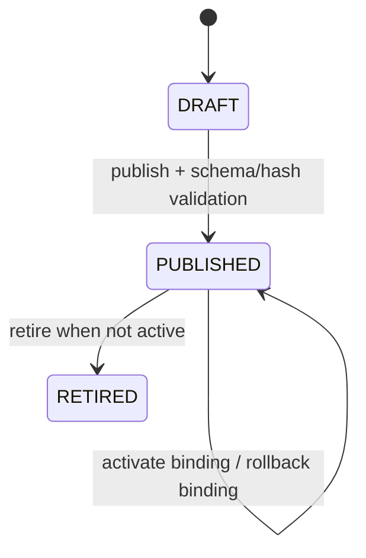

# Gate 0 领域、数据主权、状态与不变量

## 1. 模块与数据 Owner

| 聚合/数据 | 唯一 Owner | 主键 | 租户维度 | 删除策略 |
|---|---|---|---|---|
| BusinessOrgUnit | Foundation/ORG | BIGINT | `tenant_id` | 禁止物理删除；`ACTIVE/INACTIVE` |
| Store | Foundation/ORG | BIGINT | `tenant_id` | 禁止物理删除；`PREPARING/ACTIVE/INACTIVE` |
| StaffScope | Foundation/RBAC | BIGINT | `tenant_id` | 撤销以 `REVOKED` 状态和审计表达 |
| ConfigTemplate | Foundation/CFG | BIGINT | `tenant_id` | 状态停用，不物理删除 |
| ConfigTemplateVersion | Foundation/CFG | BIGINT | `tenant_id` | `DRAFT→PUBLISHED→RETIRED`；发布后不可改写 |
| ConfigBinding | Foundation/CFG | BIGINT | `tenant_id` | 激活新版本并保留 previous version |
| AuditEvent | Foundation/AUD | BIGINT | `tenant_id` | 只允许 INSERT/SELECT，禁止 UPDATE/DELETE |

平台 `sys_tenant/sys_dept/sys_user/sys_role` 的 Owner 仍是 RuoYi 系统模块。业务模块只保存必要的稳定引用，不反向改写平台身份事实。

## 2. 组织与门店不变量

- 同一租户内组织编码唯一，父节点必须属于同一租户，节点不可成为自己的祖先；Gate 0 最大层级 8。
- 同一租户内门店编码唯一；门店必须引用本租户有效组织。
- IANA `ZoneId` 必须可解析；营业日起点使用本地 `HH:mm`，取值 `00:00..23:59`。
- `business_date = localDate(instant, zone) - 1 day` 当本地时间早于营业日起点，否则为本地日期。
- 已产生下游事实后时区/营业日起点变更必须版本化并只对未来生效；Gate 0 尚无交易事实，仍记录审计和乐观锁版本。
- 门店和组织停用不删除历史引用；停用父组织前必须确保没有 ACTIVE 子组织/门店。

## 3. 员工数据范围不变量

- 功能权限由 `@SaCheckPermission` 服务端校验；对象访问再由 `ScopeAuthorizationService` 校验。
- 范围类型仅为 `TENANT/ORG_SUBTREE/STORE`。租户管理员可拥有 `TENANT`；普通员工不得自行授予或扩大范围。
- grant/revoke 必须由 `foundation:scope:grant` 权限执行，并写追加式领域审计。
- 一个 scope 的 org/store 参数必须与类型匹配且属于当前租户；跨租户 ID 即使数字相同也不得命中。

## 4. 配置模板状态机

- 已发布版本内容、Schema 版本、摘要和版本号不可修改；修复必须创建新版本。
- 同一模板版本号唯一且严格递增；`content_sha256` 对规范化 UTF-8 JSON 计算。
- 激活只允许 PUBLISHED 版本；绑定保存 current/previous，回退只能指向本模板仍为 PUBLISHED 的历史版本。
- 模板行业枚举为 `CONVENIENCE/SLACK_DISCOUNT/COMMUNITY_SUPERMARKET`，差异只存在版本化 JSON 和批准的能力键中，不进入订单/支付/库存状态机。

## 5. 审计不变量

- 审计字段：tenant、actor、correlation、action、target type/id、result、occurred_at UTC、before/after SHA-256、脱敏摘要。
- 审计写入与被审计的 Gate 0 变更处于同一数据库事务；审计失败则业务变更回滚。
- `password/token/secret/key/card/phone/idNo` 等键值在序列化前删除或掩码；原始支付报文不进入审计。
- 数据库账户对 `jsh_audit_event` 不授予 UPDATE/DELETE 是生产部署要求；Gate 0 迁移另用触发器阻断应用层改删并由集成测试验证。

## 6. 容量基线

单租户 Alpha 设计上限：组织 1,000、门店 10,000、员工范围 100,000、配置版本 10,000、审计事件 1,000 万。所有在线列表必须分页；索引的第一选择性维度包含 `tenant_id`。审计保留/归档属于后续运维策略，Gate 0 不物理清理。
