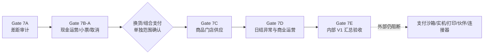

# Gate 7B—7E 依赖图与逐步验收计划

## 1. 总体原则

Gate 7 只补充经 Gate 7A 证明确实缺失的商业 V1 内部能力。每项必须经历 `DRAFT → READY → IN_PROGRESS → VERIFIED → 项目发起人确认 → ACCEPTED`；同一序列的前项未形成独立 `VERIFIED` 证据，后项保持 `DRAFT`。

## 2. Gate 7B：POS 交易运营补全

### 第一批 S20-A（建议本次评审后启动）

1. `T2-POS-010`：班次现金收支与钱箱事件；
2. `T2-POS-011`：小票模板、打印任务和补打审计；
3. `T2-ORD-004`：交易取消、作废控制和成交后反向处置。

逐项验收重点：

- SQLite 中业务事实、现金流水、审计和 Outbox 的原子边界；
- 同幂等键同摘要返回原结果，同键异摘要拒绝；
- 现金流水和订单历史只追加，禁止删除或覆盖成交事实；
- 补打生成独立任务并显示次数、原因、操作者和时间；
- 真实钱箱/打印调用仍为 0，软件层只能返回 `UNAVAILABLE/BLOCKED` 或 Fake 测试结果。

### 第二批 S20-B（不随第一批自动启动）

4. `T2-EXG-001`：换货=原单退货+新销售，需先批准独立 CR；
5. `T2-PAY-004`：Provider 无关组合/部分支付，电子份额仍受 `T2-PAY-002` 阻断。

## 3. Gate 7C：商品、门店、供应和条件业态

建议按以下顺序执行：

1. `T2-PRD-005` 秤码/金额码与精确计量快照；
2. `T2-LBL-001` 价签任务和换签异常；
3. `T2-RPL-001` 规则化库存预警与补货建议；
4. `T2-DMT-001` 开业业务资料迁移、预检和切换对账；
5. `T2-ONB-001` 门店克隆、行业模板和开店检查；
6. `T2-LOT-001` 社区超市条件批次/效期/临期。

其中 `T2-LOT-001` 不进入便利店主闭环。没有社区超市模板单独确认时保持 `DRAFT`；不得为了演示改变库存成本主键或把批次成本、库位和 WMS 带入范围。

## 4. Gate 7D：日结、异常、会员权益与商业运营

### 经营闭环 S22-A

1. `T2-CLS-001` 门店日结与逐日签署；
2. `T2-EXC-001` 统一异常认领、修复和关闭工作台；
3. `T2-MEM-003` 会员等级权益、会员价与成交快照。

### SaaS 运营 S22-B

4. `T2-SAA-001` 标准商户开户和套餐权益；
5. `T2-SUB-001` 订阅、续期、宽限、到期和降级；
6. `T2-SVC-001` 标准实施清单和服务工单。

`T2-MEM-003/SAA-001/SUB-001/SVC-001` 均须独立 CR。商业订阅只治理合同权益和使用资格，不收款、不开发发票、应收或总账。服务工单不构成已经承诺的商业 SLA。

## 5. Gate 7E：商业 V1 内部汇总验收

只有 Gate 7B—7D 实际获批项全部 `ACCEPTED` 后，才允许 `T2-E2E-004` 进入实现。验收至少包括：

- 两个虚构租户、多组织、多门店、多终端和三业态模板；
- 后台开户/门店准备→商品价格→POS 交易→现金运营→退款/反向处置→库存成本→日结异常→备份升级；
- 重复、乱序、ACK 丢失、磁盘失败、进程终止、业务日切换、跨租户、同键异内容、投影重建和前向修复；
- P0/P1 缺陷为 0，固定失败 seed、证据目录和可重复运行手册完整；
- 最高结论固定为 `INTERNAL_V1_BUSINESS_COMPLETE_CANDIDATE`。

Gate 7E 只能评估 `V1-SAA/PRD/POS/INV/PRM/SYN/API/SEC` 的内部证据。`V1-PAY/HWD/JSH/UAT` 不得因内部候选转为 ACCEPTED。

## 6. 每项 READY 前的十二项门禁

每个 Requirement 必须具备：业务价值和来源、范围与非目标、Owner 与数据主权、状态机与冻结点、不变量、权限数据范围、审计敏感字段、幂等事务补偿、API/事件错误码、MySQL/SQLite 前向迁移、容量兼容回退、合成向量和量化验收。任一缺失保持 `DRAFT`。
