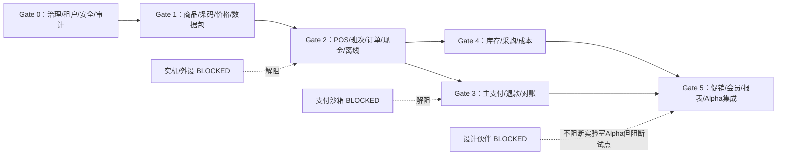

# T2 模块准入与依赖图

## 1. 数据主权

| 数据/事实 | 唯一 Owner | 只读消费者 | 禁止做法 |
|---|---|---|---|
| 租户、组织、门店、员工权限 | IAM/ORG | 所有业务域 | 客户端租户标识直接授权 |
| 商品、条码、单位 | Product | Price、POS、Inventory、Promotion | 订单反写商品主数据 |
| 价格版本 | Price | POS、Order、Promotion | POS 自行产生总部价格事实 |
| 订单与成交快照 | Order | Payment、Inventory、Report、Connector | 支付/库存改写订单行历史 |
| 支付、退款、对账 | Payment | Order 摘要、Report | 订单状态代替支付事实 |
| 库存流水与成本 | Inventory | Product、Order、Report、Connector | 直接覆盖余额而不写流水 |
| 促销规则/优惠分摊 | Promotion/Order snapshot | Refund、Report | 退款按当前促销重算 |
| 本地 Outbox/Inbox | Sync/POS | 各域适配器 | Redis/MQ 成为唯一事实 |

## 2. 依赖图

该图表达准入依赖，不表示所有模块必须串行开发。基础契约可并行评审，但未通过上游数据主权和迁移门禁的下游不得合入正式实现。

## 3. 六道门

### Gate 0：治理、平台与安全基座

候选需求：`T2-IAM-*`、`T2-ORG-*`、`T2-RBAC-*`、`T2-CFG-*`、`T2-AUD-*`、`T2-SEC-*`。

通过条件：可信租户上下文、门店授权、权限动作、审计字段、错误模型、基础迁移序列、两个虚构租户攻击矩阵和回退方案批准。

### Gate 1：商品、条码、价格与数据包

候选需求：`T2-PRD-*`、`T2-PRC-*`、`T2-DPK-*`。

通过条件：主数据 Owner、ULID/BIGINT 选择、单位换算、价格版本、导入错误、发布/回滚、10k/100k 容量和 POS 兼容窗口批准。

### Gate 2：POS、班次、订单、现金与离线

候选需求：`T2-POS-*`、`T2-ORD-*`、`T2-OFF-*`、`T2-SYN-*`。

通过条件：订单状态机/冻结点、金额不变量、现金班次、SQLite 同事务、Inbox/Outbox 幂等、崩溃恢复和冲突矩阵批准。小票实机项继续 `BLOCKED`，不得妨碍打印契约设计但阻断设备验收。

### Gate 3：主支付、退款与对账

候选需求：`T2-PAY-*`、`T2-REF-*`、`T2-REC-*`。

通过条件：支付沙箱已解阻；Provider 契约、UNKNOWN、查询/回调合并、退款、账单和对账差异处置批准。禁止自动二次扣款。

### Gate 4：库存、采购、盘点与成本

候选需求：`T2-INV-*`、`T2-PUR-*`、`T2-CST-*`、`T2-TRF-*`。

通过条件：库存维度、不可变流水、预占边界、并发、负库存策略、单位换算、移动加权成本、重算对账和冲正流程批准。

### Gate 5：基础促销、会员、报表与 Alpha 集成

候选需求：`T2-PRM-*`、`T2-MEM-*`、`T2-RPT-*`、`T2-UAT-*`、`T2-REL-*`。

通过条件：促销确定性与金额守恒、退款快照还原、会员隐私最小化、报表不成为事实源、全链路故障矩阵和 Alpha Go/No-Go 通过。

## 4. 每道门的共同产物

1. 已批准的 Requirement ID 与非目标；
2. 状态机、不变量、权限/审计、幂等/补偿；
3. OpenAPI/事件/Schema 及兼容策略；
4. Flyway/SQLite 迁移、容量和前向修复；
5. 单元、属性、集成、租户攻击、故障和恢复测试；
6. 监控、告警、Runbook、证据清单和回退触发；
7. RTM 状态和独立评审人。

## 5. 禁止的并行方式

- 在订单聚合未冻结前实现支付/库存对订单的写入；
- 在价格和促销快照未定义前实现退款金额重算；
- 在租户/门店上下文未通过攻击测试前实现业务 Mapper；
- 在正式迁移序列未批准前手工建表；
- 在 Provider/硬件资料缺失时用 Fake 类直接作为生产适配器；
- 把所有 Gate 同时转为 `READY`。
