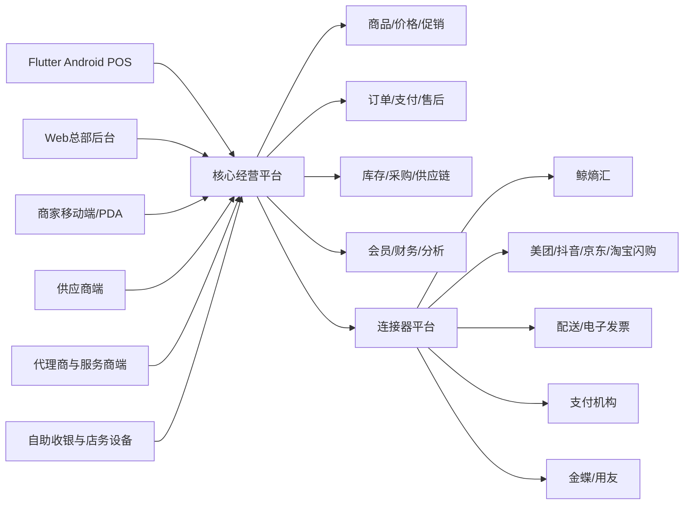

# 连接器型商业收银经营平台

## 商业可落地优化版完整功能规划 V3.0

> 文档性质：产品立项基线、总体需求规格、架构边界与商用验收依据  
> 适用范围：中国大陆零售门店、成长型连锁及相关本地生活业务  
> 核心模式：核心经营平台 + 标准连接器平台 + 外部业务系统  
> 首个标准连接器：鲸熵汇  
> 文档状态：商业立项评审稿  
> 更新日期：2026年8月15日

---

# 文档说明

## 编写目的

本文档用于统一产品、研发、测试、实施、运维、售后、商务与管理层对系统建设范围的理解，并作为以下工作的共同基线：

- 产品立项、投资预算和阶段决策。
- 领域建模、系统架构、数据库与接口设计。
- 产品原型、研发任务和测试用例拆分。
- 支付、硬件、外部平台和财务系统集成。
- 门店试点、数据迁移、商业发布与验收。
- 安全、隐私、等保、灾备和持续运营建设。

本文档不是页面清单。所有功能均需同时满足业务规则、权限、审计、异常恢复、数据一致性、性能和商用验收要求。

## 目标读者

- 公司管理层、产品负责人和项目负责人。
- 零售行业专家、架构师、研发和测试团队。
- 实施、运维、客服、渠道和商务团队。
- 支付机构、硬件厂商、鲸熵汇及其他生态合作伙伴。

## 文档控制

| 项目 | 内容 |
|---|---|
| 文档名称 | 连接器型商业收银经营平台完整功能规划与商用落地方案 |
| 当前版本 | V3.0 |
| 当前状态 | 商业立项评审稿，评审通过后作为产品、研发与运营共同基线 |
| 版本所有者 | 产品负责人/项目负责人 |
| 评审角色 | 管理层、产品、架构、研发、测试、实施、运维、安全、财务与法务 |
| 变更方式 | 重大范围和核心规则变更须提交变更申请并记录影响、成本与版本 |

## 版本记录

| 版本 | 日期 | 主要变化 |
|---|---|---|
| V1.x | 2026年8月 | 确立核心平台、连接器平台和鲸熵汇外部系统边界 |
| V2.0 | 2026年8月15日 | 补充数据主权、状态机、离线、设备、开放平台、非功能指标、路线图和商用验收 |
| V3.0 | 2026年8月15日 | 对标丰派、银豹、科脉、思迅、客如云、二维火与商米生态，收敛首发市场，补充加盟结算、商品快速建档、硬件运营、客户成功、单店经济模型和阶段门禁 |
| V3.0技术路线修订 | 2026年8月15日 | 确定RuoYi-Vue-Plus模块化单体、Flutter统一客户端、Android POS优先和Windows认证后发布路线；详细规范见《技术架构与开发规范V1.0》 |

## 优先级定义

| 优先级 | 定义 | 发布要求 |
|---|---|---|
| P0 | 商业闭环或安全可靠性必需 | 未完成不得进入真实收费营业 |
| P1 | 连锁经营和规模化必需 | 商业V1后一个主要版本内完成 |
| P2 | 增值、差异化或复杂行业能力 | 依据客户验证、收益和资源排期 |
| P3 | 探索型能力 | 完成数据验证和商业论证后立项 |

优先级与开发阶段必须分开管理。例如“鲸熵汇连接器内的库存锁定”为该连接器的P0能力，但连接器整体可以安排在平台第5阶段交付。

## 核心术语

| 术语 | 定义 |
|---|---|
| 租户 | 在SaaS平台中拥有独立数据和配置边界的商户或集团 |
| 组织 | 集团、品牌、区域、加盟商、门店、仓库等经营节点 |
| 终端 | 被授权运行POS、PDA、自助收银或店务应用的设备实例 |
| 业务日期 | 门店营业归属日期，可与自然日期不同，用于夜间营业和日结 |
| 标准订单 | 外部或内部订单转换后的统一业务模型，不覆盖来源平台原始订单 |
| 连接器 | 按标准契约连接外部平台的独立适配单元 |
| 权威来源 | 对特定数据或字段拥有最终解释权的系统 |
| 现存量 | 实际账面库存数量 |
| 锁定量 | 已被订单或作业预占、暂不可再次销售的数量 |
| 可售量 | 按现存、锁定、安全库存、渠道配额计算后可对外承诺的数量 |
| Outbox/Inbox | 保障业务事务与消息可靠传递、消费幂等的收发件箱模式 |
| 设计伙伴 | 愿意共同评审流程、提供真实数据并参与试点验收的首批目标商户 |
| 标准实施包 | 在固定资料模板、硬件白名单、迁移范围和服务工时内交付的可复制开店服务 |
| 客户健康度 | 综合终端在线、交易活跃、同步质量、工单、功能使用和续费风险形成的运营指标 |
| 商业门禁 | 达到明确质量、客户、成本和服务指标后，才允许进入下一阶段的Go/No-Go条件 |

---

# 一、执行摘要

## 1.1 产品定义

本系统定义为面向单店和成长型连锁零售商户的商业经营平台。系统以稳定收银、统一商品、订单、支付、库存和会员为核心，以连接器平台对接鲸熵汇、美团、抖音、京东、淘宝闪购、配送、电子发票、持牌支付机构、金蝶和用友等外部系统。

鲸熵汇不属于POS内部商城，不作为特殊定制模块。它与其他外部平台一样，通过标准连接器接入；不得直接读写核心经营平台数据库，也不得把自身规则嵌入POS交易内核。

## 1.2 首期目标客户

- 首发聚焦标准条码商品占比较高的便利店、零食折扣店和社区超市，不同时进入餐饮、茶饮、美业等不同内核的赛道。
- 首批付费客户优先选择1至30家门店、总部管理诉求明确、愿意使用标准流程的单店和成长型连锁；系统架构支持扩展至100家门店，但不在首发阶段承诺大型集团的全部复杂能力。
- 轻量生鲜仅支持已完成认证的称重、批次、效期和临期处理；加工中心、复杂分拣、多级WMS和全链食品生产追溯后置。
- 优先服务需要对接鲸熵汇、自有业务系统或一个主流即时零售渠道，并愿意按标准接口和数据主权规则接入的商户。
- 首批客户应具备明确的决策人、基础商品资料、可配合支付进件和切换验收的门店团队，避免把不具备实施条件的客户作为产品验证样本。

餐饮、茶饮、烘焙、完整WMS、联营百货和医药合规等作为行业包后续建设，不进入首个商业版本的强制范围。

## 1.3 核心价值主张

- 使用已审核模板时，10分钟内完成系统门店创建和基础策略复制；资料齐备、支付和硬件前置条件满足后，标准门店目标在1个工作日内达到可试营业状态。
- 断网仍可完成允许离线的业务，恢复后自动、安全、可追溯地同步。
- 单店易用，发展到30家店无需更换系统；达到100家店时通过连锁增强包继续扩展核心平台。
- 商品、价格、库存、订单、会员和报表只有一套受治理的核心数据。
- 外部平台通过标准连接器接入，新增平台不修改POS交易内核。
- 所有支付、退款、调价、库存调整和审批均可追溯。
- 提供SaaS、企业专属实例和私有化部署演进能力。

## 1.4 产品原则

1. 营业连续性优先于功能数量。
2. 资金、订单和库存准确性优先于界面便利性。
3. 核心平台不依赖任何单一外部商城或渠道。
4. 数据权威来源唯一，双向同步必须细化到字段级。
5. 外部调用采用至少一次投递，通过幂等保证业务结果唯一。
6. 所有关键业务采用状态机和不可篡改流水，不直接覆盖结果。
7. 先模块化单体、后按容量和团队边界拆分服务，避免过早微服务化。
8. AI只提供建议、解释和辅助，不绕过确定性业务规则和审批。
9. 标准化优先于无边界定制；高频差异通过模板、策略集和连接器扩展，不为单一客户污染交易内核。
10. 每项商业功能都必须同时定义可销售套餐、实施方式、支持成本、监控指标和退出策略。
11. 首发只维护一套主POS技术路线、一组认证硬件和一个主支付合作方，达到商业门禁后再扩展。

## 1.5 明确不做的事情

- 不自建无牌支付、资金池、二清或资金清分业务。
- 不在首期建设完整总账、税务申报和工资系统。
- 不允许连接器直接修改核心数据库。
- 不承诺兼容所有硬件型号，只支持经过认证的白名单设备。
- 不承诺外部平台未开放或未经授权的接口能力。
- 不在首期同时建设完整零售、餐饮、医药、美业等所有行业版本。
- 不在商业V1同时交付Windows和Android两套完整POS产品线；商业V1以Flutter Android POS为正式路线，Windows在通过独立硬件认证后发布。
- 不在没有付费客户和平台授权证明前开发全部美团、抖音、京东、淘宝闪购连接器。
- 不以私有化项目作为首发收入主线；未形成标准升级、监控和交付工具前不接低毛利私有化定制。

## 1.6 V3.0商业可落地复核结论

本方案在“应该建设什么”层面已经具备商业产品蓝图的完整性，核心交易、离线、对账、库存账本、权限审计和连接器治理均达到可进入详细设计的水平。但当前工作区只有规划文档，没有可运行代码、自动化测试、硬件认证报告和真实试点数据，因此不能把“规划完整”误判为“产品已经可商用”。

| 复核维度 | 规划覆盖判断 | 当前证据 | V3.0处理 |
|---|---|---|---|
| 收银交易与异常恢复 | 完整 | 仅有规格，无实机结果 | 保持P0，增加长稳、断电和支付未知门禁 |
| 商品、库存、采购和成本 | 较完整 | 无迁移与盘点实测 | 增加商品库治理、期初核对和差异验收 |
| 连锁、加盟和供应链结算 | 原方案偏弱 | 仅有组织与基础供应商对账 | 补充加盟商独立核算、供货价、费用、返利和结算 |
| 连接器平台 | 设计完整 | 无真实授权与联调 | 按商业合同和授权排期，首发只做支付与鲸熵汇最小闭环 |
| 硬件与门店运维 | 技术项较完整 | 无白名单与备件体系 | 补充设备商品化、RMA、备机、远程运维和服务商考核 |
| 实施、客服与客户成功 | 流程存在但不足 | 无工时、成本、续费数据 | 补充标准实施包、健康度、续费、流失和服务成本指标 |
| 商业模式和版本包装 | 原方案较粗 | 尚无成交与毛利验证 | 改为软件套餐、连接器、实施、硬件和高级支持分层收费 |
| 产品市场匹配 | 方向合理 | 尚无设计伙伴和付费试点 | 用5家设计伙伴、3至5家实店、30家付费门店逐级验证 |

结论分为三档：文档可用于立项；产品需经过研发和试点后才可收费；规模化运营需在付费门店、服务成本和续费指标达标后才能启动。现阶段最重要的优化不是继续增加页面，而是收敛首发范围并补齐交付运营体系。

## 1.7 适合本项目的首发产品楔子

建议将首发产品定义为“面向1至30家便利零售门店的稳定收银与轻连锁经营系统”，用三项差异化能力切入：

1. 本地可营业：断网、断电、支付未知和升级失败均有确定恢复路径。
2. 连接器标准化：鲸熵汇与其他平台使用同一套契约、映射、重试、监控和审计机制。
3. 低实施成本：行业模板、商品快速建档、门店克隆、认证硬件、自检和远程诊断形成可复制交付。

首发不与成熟厂商比拼全行业功能数量，而是以“交易更可靠、接口更干净、交付更标准”建立可验证优势。供应链、加盟结算和即时零售作为连锁客户升级路径，不应拖慢第一家真实门店开业。

## 1.8 商业V1严格边界

| 必须交付 | 允许简化 | 明确后置 |
|---|---|---|
| 一套Flutter Android POS、一个主支付适配器、现金、退款、交班、打印、离线与恢复 | 会员仅档案、等级、积分；促销只做高频确定性规则 | Windows正式版、储值、复杂券营销、CDP和全域私域运营 |
| 商品、条码、价格、采购入库、库存流水、盘点、基础成本 | 轻连锁只支持总部模板、商品价格下发和基础调拨 | 完整WMS、生产加工、联营百货和复杂业财一体 |
| SaaS开户、权限、审计、监控、备份、升级、工单与标准实施工具 | 鲸熵汇只完成一个标准订单、库存、退款和对账闭环 | 美团、抖音、京东、淘宝闪购全部同时上线 |
| 销售、支付、库存、交班和对账报表 | 移动端先做老板看板、审批和核心店务 | AI收银、自助收银、智能补货和自然语言问数 |

任何新增V1需求必须说明目标付费客户、合同金额、通用复用率、交付工时、质量风险和被替代方案，经范围委员会批准后才能进入。

---

# 二、总体架构与系统边界

## 2.1 逻辑架构

## 2.2 分层说明

| 层级 | 主要职责 | 约束 |
|---|---|---|
| 门店边缘层 | POS本地交易、设备驱动、离线数据、打印、同步队列 | 任何云端短时故障不得阻断允许离线的营业 |
| 访问层 | API网关、BFF、身份认证、限流、请求审计 | 不承载核心业务规则 |
| 核心领域层 | 商品、价格、订单、支付引用、库存、采购、会员、财务业务 | 采用明确领域边界和状态机 |
| 平台能力层 | 多租户、权限、配置、审批、消息、套餐、审计 | 供所有业务域复用 |
| 连接器层 | 数据转换、平台授权、同步、回调、补偿和对账 | 不直接访问其他系统数据库 |
| 数据与分析层 | 交易库、缓存、对象存储、搜索、数仓和指标语义 | 报表不得反向修改交易数据 |

## 2.3 核心领域边界

- 商品中心负责基础档案，不负责商城页面装修。
- 价格中心负责基础价格和平台内促销，不覆盖外部平台独立活动价格。
- 订单中心负责标准订单和内部业务状态，不修改来源平台原始单据。
- 支付中心负责支付指令、引用、查询、退款和对账，不持有商户资金。
- 库存中心是库存账本和可售量的唯一权威来源。
- 会员中心负责统一客户身份、权益和账本，外部用户通过身份映射关联。
- 连接器平台负责协议适配和运行治理，不承载渠道特有的商城体验。

## 2.4 部署形态

| 形态 | 适用客户 | 数据隔离 | 升级方式 |
|---|---|---|---|
| 标准SaaS | 单店和中小连锁 | 共享集群、租户逻辑隔离 | 平台统一灰度升级 |
| 企业专属实例 | 中大型连锁 | 独立应用或独立数据库 | 约定维护窗口升级 |
| 私有化部署 | 数据或网络有特殊要求的集团 | 客户专有环境 | 建立版本基线和升级服务合同 |

私有化不是简单复制安装包。必须额外定义基础设施责任、监控权限、备份责任、证书更新、远程支持、版本滞后范围和安全补丁SLA。

---

# 三、完整功能规划

## 3.0 功能交付矩阵

| 业务域 | P0商业闭环 | P1规模化 | P2/P3增强 |
|---|---|---|---|
| SaaS平台 | 租户、组织、权限、配置、审计 | 套餐、计量、开户、资源隔离 | 企业专属实例、复杂计费 |
| 商品 | SKU、条码、单位、导入、状态 | 多范围、批次效期、税务、变更发布 | 加工商品、智能建档 |
| 价格 | 基础价、门店价、改价控制 | 区域价、未来价格、会员价 | 批发价、复杂渠道价 |
| 促销 | 改价、整单折扣、抹零 | 单品、整单、组合、优惠券和分摊 | 预算、自动优化和促销分析 |
| POS | 开班、销售、支付、退货、交班、离线 | 组合支付、电子小票、跨店退货 | 自助收银和多操作系统 |
| 订单 | POS订单、快照、状态机 | 外部订单、履约、部分售后 | 复杂拆包、替代和预售 |
| 支付 | 下单、查询、撤销、退款、幂等 | 组合支付、账单、自动对账 | 多支付机构策略 |
| 库存 | 余额、流水、销售出库、采购入库、盘点 | 预占、调拨、批次、成本 | 渠道配额、复杂成本 |
| 采购供应链 | 供应商、采购、收货、退货 | 要货、配送、PDA、对账 | 智能补货、WMS、联营代销 |
| 会员 | 档案、身份识别 | 等级、积分、优惠券和分析 | 储值、自动化营销 |
| 店务 | 基础查库存和通知 | 移动收货、盘点、任务、临期 | 巡店、AI识别 |
| 财务分析 | 销售、收银、库存基础报表 | 指标层、月结、经营驾驶舱 | 凭证连接和高级BI |
| 审批异常 | P0异常告警和关键操作审批 | 通用工作流、待办和通知 | 智能异常解释 |
| 设备边缘 | 激活、打印、扫码、钱箱、远程日志 | 电子秤、标签、客显、白名单 | 自助设备、电子价签 |
| 连接器 | 支付适配、SDK骨架、鲸熵汇最小闭环 | 鲸熵汇完整、发票、开放平台 | 美团、抖音、京东、淘宝闪购、配送、财务 |
| 实施售后 | 开店检查、迁移、基础工单 | 代理商、SLA、知识库、远程诊断 | 渠道绩效和客户健康度 |
| 安全合规 | 租户隔离、加密、密钥、备份、审计 | 隐私权利、等保、灾备和安全测试 | 高等级专属合规能力 |

## 3.1 SaaS平台基础

### 3.1.1 多租户与租户生命周期

- 租户创建、审核、启用、暂停、恢复、注销和归档。
- 租户编码、行业、时区、默认币种、业务日期和数据地域。
- 套餐、功能包、门店数、终端数、API调用量和存储配额。
- 试用期、宽限期、到期降级、续费恢复和终止服务。
- 租户数据导出、注销申请、留存期限、匿名化和安全删除。
- 大租户资源隔离、限流、独立任务队列和热点保护。
- 租户级开关、灰度名单、实验配置和紧急禁用。

### 3.1.2 组织架构

- 集团、法人主体、品牌、事业部、区域、加盟商、门店、仓库和终端。
- 组织树版本管理，支持组织迁移、生效日期和历史归属查询。
- 直营、加盟、托管等门店经营属性。
- 门店营业时间、跨夜营业、时区、业务日切换规则。
- 门店支付商户号、发票主体、库存组织和结算主体绑定。
- 门店开业、停业、临时歇业、闭店和数据归档。

### 3.1.3 员工、身份与权限

- 员工、岗位、角色、菜单权限、数据权限、字段权限和金额权限。
- 总部、区域、门店和仓库范围的数据授权。
- RBAC为主，结合门店、组织、金额、时间和设备的属性控制。
- 收银员快速登录、工号、密码、实体卡和受控生物识别登录。
- 高风险操作二次认证和MFA。
- 制单、审核、出纳、退款等职责分离。
- 临时授权、代理审批、权限生效和失效日期。
- 离职停用、会话吊销、设备解绑和密钥回收。
- 登录、授权变更和越权访问审计。

### 3.1.4 配置、字典和业务参数

- 平台、行业、集团、区域、门店、终端多级参数继承。
- 参数覆盖顺序、版本、生效时间、审批和回滚。
- 支付、打印、库存负数、退货、抹零、交班等业务开关。
- 配置变更影响分析和下发状态。
- 配置导入导出、模板复制和环境差异比较。

### 3.1.5 套餐、授权与计量

- 基础版、专业版、连锁版和企业版套餐。
- 功能包、终端点位、连接器、API额度、数据保留和服务等级。
- 设备激活码、在线许可证、离线宽限期和防回拨校验。
- 使用量计量、超额提醒、限制策略和账单明细。
- 试用转正式、升降配、按比例计费和退款规则。

### 3.1.6 商户开户和数据迁移

- 行业模板、组织模板、商品模板、权限模板和小票模板。
- 开户向导、资料完整度、前置依赖清单、门店初始化、终端激活和首班准备。
- 试用租户、演示数据、正式租户转换、试用数据清理和授权生效。
- 标准门店克隆：组织、角色、商品范围、价格策略、促销范围、打印、支付和店务任务按模板复制。
- 商品、供应商、会员、积分、余额、库存和成本导入。
- 导入预览、字段映射、格式校验、重复检测、数据质量评分和错误报告。
- 幂等重复导入、批次回滚、导入审计和验收确认。
- 新旧系统并行、期初确认、总额与抽样明细核对、差异签字和正式切换。
- 记录首次商品创建、首次终端在线、首次开班、首次销售和首次日结，形成激活漏斗。

### 3.1.7 审计日志

- 登录、权限、商品、价格、促销、库存、采购、退款和支付操作。
- 记录操作前值、操作后值、操作人、设备、IP、原因和审批单。
- 审计日志防篡改、访问授权、保存期限和导出水印。
- 高风险操作实时告警。

### 3.1.8 配置模板与策略集

- 按业态提供便利店、零食折扣和社区超市模板，模板具有版本、负责人、适用范围和变更说明。
- 将收银、退货、库存、会员、审批、打印和营业日期规则组成门店策略集，避免散落开关造成配置爆炸。
- 总部可锁定强制策略、允许区域继承并限制门店覆盖；覆盖必须记录原因和有效期。
- 新模板先在沙箱门店模拟，再灰度到试点门店，最后批量发布；支持差异预览、回滚和终端签收。
- 建立配置健康检查，识别互相冲突、缺失依赖、长期未使用和偏离标准的参数。

## 3.2 商品与主数据中心

### 3.2.1 商品档案

- SPU、SKU、分类、品牌、系列、规格、属性和生命周期状态。
- 普通、称重、计数、组合、赠品、服务、加工和虚拟商品。
- 主条码、扩展条码、内部码、箱码、秤码和供应商货号。
- 一品多码、一码多包装和条码冲突检测。
- 销售、采购、库存、配送和称重单位及换算关系。
- 图片、短名称、长名称、打印名称和拼音检索。
- 上市、停售、淘汰、门店停售和渠道停售。
- 可退货、可折扣、可积分、可开票、年龄限制等销售属性。

### 3.2.2 采购与供应属性

- 默认供应商、备选供应商、供货范围和采购负责人。
- 采购规格、箱规、起订量、整箱约束、交货周期和最小订货倍数。
- 采购含税价、未税价、税率、返利和历史价格。
- 供应商商品编码及变更历史。

### 3.2.3 批次、效期和追溯属性

- 是否启用批次、生产日期、保质期和有效期。
- 收货剩余效期门槛、临期天数和禁售时间。
- 批次追溯码、产地、供应商和检验信息。
- 先进先出或先到期先出策略。

### 3.2.4 税务和财务属性

- 税率、含税标识、税收分类编码和发票项目。
- 收入、成本、库存和采购科目映射。
- 发票商品名称与内部商品名称映射。
- 税务属性生效日期和历史快照。

### 3.2.5 商品范围和发布

- 总部商品池、区域商品池、门店经营范围和渠道经营范围。
- 新品申请、资料审核、发布、撤回和门店下发。
- 商品变更版本、差异比较、失败重发和终端接收确认。
- 商品删除采用停用或终止销售，不删除历史交易引用。

### 3.2.6 外部商品映射

- 外部平台商品、规格、单位与内部SKU多层映射。
- 自动匹配建议、人工确认、未映射队列和批量处理。
- 映射版本、有效期、变更影响和历史订单保持。
- 一个内部SKU映射多个渠道商品；禁止歧义反向覆盖。

### 3.2.7 商品快速建档与商品资料库

- 扫码查询受许可的公共商品资料或商户私有商品库，返回候选名称、品牌、规格、单位、图片和分类，必须由商户确认后入库。
- 公共条码和商品资料必须明确数据来源、授权范围、更新周期和纠错机制，不得抓取或销售无权使用的数据。
- 支持从历史系统、供应商目录和鲸熵汇等外部来源提出建档候选，但每个字段仍按数据主权和审核流程落库。
- 快速建档只允许创建待完善或待审核商品；采购价、税率、库存属性、称重规则和禁售属性未完成时限制发布。
- 建立重复商品、疑似一码多品、规格异常、单位换算异常和图片侵权风险队列。

### 3.2.8 标签、价签与陈列数据

- 普通价签、促销价签、称重标签、箱码和拣货标签模板统一管理。
- 价签打印记录商品、价格版本、门店、打印人和时间，支持调价后未换签异常清单。
- 电子价签作为P2设备适配器，使用标准商品和价格事件驱动，不直接读取价格表。
- 货架、排面、陈列位和计划图先保留基础模型，完整空间管理根据连锁客户验证后建设。

## 3.3 价格中心

### 3.3.1 价格类型

- 建议零售价、总部零售价、区域价、门店价和时段价。
- 会员等级价、员工价、批发价、加盟供货价和渠道价。
- 含税价、未税价和价格精度。

### 3.3.2 价格版本和发布

- 调价单、审批、生效时间、失效时间和未来价格。
- 按商品、分类、品牌、区域、门店和渠道批量调价。
- 原价、促销价和实际成交价快照。
- 调价下发、终端签收、失败重试、回滚和影响分析。
- 价格版本必须可离线缓存并具备有效期。

### 3.3.3 价格控制

- 最低售价、最低毛利率、最高折扣和改价权限。
- 收银员、店长、区域和总部不同授权范围。
- 超阈值审批、原因必填和审计。
- 抹零方式、舍入方式和税额尾差分配。

## 3.4 促销与优惠引擎

### 3.4.1 促销能力

- 单品特价、折扣、第二件优惠和限量优惠。
- 满减、满折、满赠和阶梯优惠。
- 任选组合、买赠、换购、套餐和搭售。
- 会员日、等级专享、时段、门店和渠道促销。
- 满减券、折扣券、兑换券、商品券和运费券。

### 3.4.2 规则模型

- 条件、效果、适用范围、时间、预算和使用次数。
- 优先级、互斥组、叠加组、排除商品和会员限制。
- 每单、每人、每日和活动周期限制。
- 促销试算、冲突检测、模拟订单和效果预览。
- 促销规则版本、发布、灰度、暂停和回滚。

### 3.4.3 优惠分摊与退货

- 优惠按商品可分摊金额、数量或价格比例分摊。
- 平台补贴、商家承担、供应商承担分别记录。
- 部分退货按原订单优惠快照计算，不重新运行当前促销。
- 赠品退货、满赠条件破坏和换购退货规则。
- 优惠券冻结、核销、退回和过期状态机。

### 3.4.4 离线促销

- POS保存已发布且签名校验通过的促销版本。
- 离线仅执行允许离线、计算确定的促销。
- 需要在线额度、会员实时状态或跨渠道核销的活动离线不可用。
- 订单保存规则版本、输入条件、命中过程和分摊结果。

## 3.5 POS收银内核

### 3.5.1 登录与班次

- 终端激活、门店校验、员工登录和开班检查。
- 开班、备用金、现金收支、钱箱盘点、存现和交班。
- 长短款、原因、复核、日结和重新开班。
- 跨夜营业和业务日期归属。
- 交班后禁止修改已归属班次的交易。

### 3.5.2 销售操作

- 扫码、搜索、拼音、快捷商品、无码商品和称重商品。
- 数量、单位、批次、价格、导购和备注修改。
- 挂单、取单、合并、删除和超时清理。
- 会员识别、权益展示、促销试算和优惠选择。
- 改价、折扣、抹零和权限验证。
- 多次扫描防抖、条码不存在处理和快速建档申请。
- 年龄限制商品、停售商品、过期商品和库存不足提示。

### 3.5.3 收款

- 现金、微信、支付宝、银行卡、会员权益和组合支付。
- 应收、实收、找零、舍入和支付备注。
- 主扫、被扫、独立支付终端和人工确认方式。
- 支付处理中禁止重复发起。
- 未知状态必须先查询，不能直接判定失败并再次扣款。

### 3.5.4 退货与反向交易

- 整单退、部分退、按数量退和按金额退。
- 原路退款、现金退款、退款失败重试。
- 无单退货、超期退货、跨店退货和审批。
- 退回库存、残次库存、不入库和批次归还。
- 退货后积分、优惠券、赠品和会员成长值冲回。

### 3.5.5 小票和打印

- 小票模板、门店Logo、商品明细、支付明细和二维码。
- 正常打印、补打、电子小票和打印日志。
- 打印失败重试、备用打印机和重复打印标识。
- 标签、价签、称重标签和拣货单打印。

### 3.5.6 离线与异常恢复

- 本地商品、价格、允许离线的促销和员工权限缓存。
- 本地订单事务、Outbox、失败重试和同步检查点。
- 应用崩溃、操作系统重启和断电后的未完成订单恢复。
- 支付成功但订单未完成时主动查询并补齐。
- 本地数据加密、容量预警、归档和清理。

### 3.5.7 POS更新

- 版本检测、下载校验、灰度、静默安装和强制升级。
- 数据库迁移前备份、失败回滚和最低兼容版本。
- 关键营业时段禁止自动升级。
- 远程停用、紧急回退和版本分布统计。

### 3.5.8 收银风险与防损

- 删除商品、整单作废、改价、超额折扣、无单退货、跨店退货、重复补打、手工确认支付和钱箱开启统一记录风险事件。
- 可按员工、门店、班次、时间段、金额、频次和毛利阈值配置实时提醒或事后复核，不影响正常低风险交易效率。
- 识别闭店后交易、连续小额退款、异常零售价、负毛利销售、同一订单多次操作和收银员自购等规则型异常。
- 每个风险事件关联订单、支付、操作日志、审批和可选视频时间点；视频系统只通过授权连接器关联，不把生物识别作为首发依赖。
- 风险案件支持认领、调查、证据、结论、损失金额、整改和复核，规则命中不等同于认定舞弊。

### 3.5.9 现金与钱箱管理

- 备用金、现金收入、现金退款、现金支出、抽大钞、存现、钱箱盘点和长短款形成完整流水。
- 支持一机一箱、一班一箱和多人共享钱箱三种策略；首发只启用一种经试点确认的标准策略。
- 开钱箱必须关联销售、找零、交班盘点或获批原因；无关联开启进入异常中心。
- 连锁增强包支持保险柜上缴、银行存款登记、押运交接和门店现金在途，首发仅保留接口与单据模型。

## 3.6 统一订单中心

### 3.6.1 订单类型

- POS销售订单、外部渠道订单、批发订单和预订单。
- 退货订单、换货订单和补差订单。
- 外部来源原始订单与内部标准订单并存，建立唯一映射。

### 3.6.2 标准订单结构

- 订单头、订单行、商品快照、价格快照和税务快照。
- 来源平台、商户、门店、终端、班次、员工和业务日期。
- 原价、优惠、应收、实收、退款、配送费和包装费。
- 商家、平台、供应商等不同优惠承担方。
- 会员身份快照和隐私脱敏信息。
- 外部订单号、内部订单号和关联单据链。

### 3.6.3 订单状态机

- 草稿、待支付、支付处理中、已支付、履约中、已完成。
- 取消中、已取消、售后中、部分退款和已退款。
- 状态变更必须由受控命令触发并记录事件。
- 禁止任意跨状态修改；异常修复也必须形成补偿单据。

### 3.6.4 履约订单

- 自动接单、人工接单、拒单和超时接单。
- 门店或仓库分配、备货、拣货、复核和出库。
- 缺货、替代品、重量调整、拆包和部分履约。
- 到店自提、商家配送、平台配送和第三方配送。
- 核销码、取货码、签收和配送凭证。

### 3.6.5 售后订单

- 取消、退款、退货退款、仅退款、补发和拒绝售后。
- 售后原因、责任方、证据、审批和平台仲裁结果。
- 多次部分退款累计不能超过可退金额。
- 资金退款、库存回补、积分冲回和发票红冲分别跟踪。

### 3.6.6 异常补偿

- 重试、死信、人工补单、重新映射和重新同步。
- 原始报文、标准报文、错误码和处理轨迹。
- 补偿操作必须幂等并保留操作人、原因和审批记录。

## 3.7 支付、退款与对账中心

### 3.7.1 支付边界

- 仅通过持牌机构、银行或合规支付服务商完成资金处理。
- 平台不留存商户资金，不建立资金池，不实施二次清算。
- 外部商城或平台已完成的支付只接收验证后的支付引用和状态。
- 银行卡由独立终端完成时，POS记录终端流水和核对结果。

### 3.7.2 支付操作

- 支付下单、查询、关闭、撤销、退款和退款查询。
- 主扫、被扫、动态二维码、独立终端和现金。
- 一单多次支付、多方式组合支付和支付顺序控制。
- 订单支付金额、支付单金额和渠道请求金额强校验。

### 3.7.3 支付状态机

- 待支付、处理中、成功、明确失败、未知和关闭。
- 部分退款、退款中、已退款和退款失败。
- 未知状态不得自动重新扣款，必须查询或人工确认。
- 回调和主动查询结果冲突时，按支付机构规则和时间线处理。

### 3.7.4 幂等与安全

- 商户、渠道和订单范围内唯一支付请求号。
- 请求签名、回调验签、证书轮换、时间戳和防重放。
- 支付密钥存储在密钥管理系统，不写入日志和配置文件。
- 敏感字段脱敏，最小化保存支付信息。
- 支付适配器采用独立安全边界、独立告警和更严格发布流程。

### 3.7.5 对账

- 内部订单账、支付流水账、渠道账单、平台结算单和银行到账。
- 支付、退款、撤销、手续费、佣金、补贴、配送费和调整项。
- 自动下载、文件验签、重复账单识别和断点续传。
- 单边账、金额不符、状态不符、漏单和重复单。
- 差异认领、调查、调整、审批、关闭和重新对账。
- 日对账、结算周期、节假日到账和月结锁定。

## 3.8 库存与成本中心

### 3.8.1 库存模型

- 现存量、可用量、锁定量、可售量、在途量、残次量和待检量。
- 仓库、门店、货位、批次、库存状态和所有权维度。
- 可售量公式由现存量、锁定量、安全库存、渠道缓冲和配额计算。
- 库存余额是流水汇总结果，流水不可物理删除。

### 3.8.2 库存流水

- 销售、退货、采购、调拨、盘点、损益、加工和调整。
- 来源单据、来源行、前后数量、成本、批次和操作人。
- 同一业务命令幂等，禁止重复扣减和重复回补。
- 错误通过反向单据修正，不直接覆盖历史流水。

### 3.8.3 库存预占

- 下单锁定、取消释放、履约扣减和超时释放。
- 预占有效期、延长、部分释放和替代品处理。
- 乐观锁、版本号或原子脚本控制并发。
- 按渠道设置库存配额、缓冲量和超卖策略。
- 全量库存校准不得覆盖未完成预占。

### 3.8.4 出入库和调拨

- 销售出库、退货入库、采购入库、采购退货和其他出入库。
- 调拨申请、审核、出库、在途、收货和差异处理。
- 多发、少发、破损、拒收和在途损失。
- 单据过账后不可直接修改，通过冲销和重新制单处理。

### 3.8.5 盘点

- 全盘、抽盘、循环盘点和临时盘点。
- 明盘、盲盘、冻结盘点和动态盘点。
- 任务下发、多人协作、复盘、差异审批和损益过账。
- 明确盘点期间销售入库的时间截点和归属规则。

### 3.8.6 批次效期

- 批次、生产日期、有效期、供应商和追溯信息。
- 临期预警、禁售、折扣、下架和报损任务。
- 先进先出或先到期先出建议。
- 批次退货和质量召回范围查询。

### 3.8.7 成本核算

- 首期采用移动加权平均成本。
- 采购入库、退货、调拨、盘点和负库存成本规则。
- 暂估入库、采购价调整和成本调整单。
- 负库存回补后的成本重算和差异记录。
- 商品、门店、仓库和期间成本结转。

## 3.9 采购、补货、供应商和仓储

### 3.9.1 供应商管理

- 供应商档案、法人信息、联系人、资质、有效期和风险状态。
- 供货商品、供货组织、价格、账期、结算方式和配送周期。
- 供应商启停、黑名单、变更审批和历史记录。
- 资质到期提醒和禁止采购规则。

### 3.9.2 采购业务

- 采购申请、询价、采购订单、收货、入库和采购退货。
- 总部采购、门店直采、总仓统采和供应商直送。
- 多收、少收、拒收、赠品、费用和税额。
- 原单退货、无原单退货、退货成本和应付调整。

### 3.9.3 门店要货和配送

- 门店要货、总部审核、库存分配、缺货分配和配货。
- 总仓统配、供应商直送、越库配送和门店调拨。
- 波次、拣货、复核、装箱、出库、运输和收货。
- 箱、周转筐、物流单和配送差异。

### 3.9.4 补货

- 最低最高库存、安全库存、订货周期和交货周期。
- 日均销量、趋势、活动、天气等扩展因子预留。
- 建议补货、人工调整、审核、转采购或要货单。
- 建议依据和预测误差可解释、可复盘。

### 3.9.5 PDA作业

- 扫码收货、上架、拣货、复核、盘点和移库。
- 离线任务、断点续作、条码错误和重复扫描提示。
- 操作人与设备追踪、拍照和异常原因。

### 3.9.6 供应商对账

- 采购入库、退货、费用、返利、预付款和结算。
- 对账单生成、供应商确认、争议、调整和关闭。
- 对账周期、账期、付款计划和财务系统同步。

### 3.9.7 购销、代销与联营结算模型

- 购销按入库和采购成本形成应付；代销按实际销售、退货和约定进价结算；联营按销售净额、扣点和费用结算。
- 供应商费用支持进场、陈列、配送、促销、返利和质量扣款，费用必须关联合同条款、期间和审批。
- 对账遵循“业务单据确认—对账单—争议调整—结算确认—财务输出”，禁止直接改写已确认来源单据。
- 首发只交付购销；代销和联营作为P1/P2行业能力，必须经过财务、税务与目标客户专项评审。

### 3.9.8 加盟订货与往来结算

- 加盟店可按总部、区域仓或指定供应商订货，支持门店等级供货价、合同价、阶梯价、活动供货价和有效期。
- 管理订货款、预付款、保证金、加盟费、管理费、配送费、返利、扣补和其他往来项目。
- 加盟店收货差异、退货、拒收、总部代垫、跨期调整均产生可追溯往来流水。
- 总部与加盟商按账期生成结算单、对账确认、争议、调整和财务凭证；系统不直接执行资金划拨，合规分账由持牌机构连接器完成。
- 总部可设置强制采购目录、最低订货频次和违规预警，但不得在未授权情况下查看加盟商非总部供货商品的敏感经营数据。

完整货位、波次优化、容器、自动化设备和仓库绩效属于P2 WMS能力，不进入商业V1。

## 3.10 会员、积分、优惠券与储值

### 3.10.1 统一客户身份

- 手机号、会员码、实体卡、微信OpenID/UnionID和外部平台用户ID。
- 一个客户多个身份凭证，禁止直接以手机号作为永久技术主键。
- 身份绑定、解绑、合并、重复会员处理和人工审核。
- 外部身份仅保存必要映射，遵循平台授权和隐私要求。

### 3.10.2 会员档案与隐私

- 基本资料、联系方式、生日、来源、注册门店和同意记录。
- 可选字段和必填字段最小化。
- 数据访问脱敏、导出审批、修改和删除申请。
- 营销同意、撤回、黑名单和触达偏好。

### 3.10.3 会员等级

- 等级、成长值、升级、保级、降级和有效期。
- 等级权益、会员价、积分倍率、专属券和服务权益。
- 等级计算任务、补算、调整和审计。

### 3.10.4 积分账本

- 获取、冻结、解冻、消费、过期、退回和人工调整。
- 每笔变动关联来源订单和规则版本。
- 可用积分由账本计算，禁止直接覆盖余额。
- 积分有效期、先进到期先使用和过期提醒。

### 3.10.5 优惠券账本

- 发放、领取、冻结、核销、解冻、退回、作废和过期。
- 券模板与券实例分离。
- 防重复核销、跨渠道状态同步和退款退券规则。

### 3.10.6 储值

- 作为独立合规模块后置建设。
- 实充余额和赠送余额分账记录。
- 充值、赠送、消费、退款、退卡和异常调整。
- 资金主体、适用门店、有效期、退款顺序和余额责任明确。
- 上线前完成单用途预付、消费者权益和财务处理专项评估。

### 3.10.7 跨门店权益与加盟结算

- 明确会员资产发行主体、适用门店、总部与加盟商责任，以及门店退出时未消费权益的承担方式。
- 跨店积分、券和储值消费分别记录发行门店、核销门店、总部补贴、商户承担和结算周期。
- 会员共享不等于数据无限共享；加盟商只访问经营所需的会员信息，敏感资料和跨品牌画像由总部受控管理。
- 复杂储值分账必须通过持牌支付或合规分账方案实现，核心系统仅保存业务权益账本、结算依据和外部资金引用。

## 3.11 店务、移动端和连锁运营

- 移动查商品、查价格、查库存和查批次。
- 移动收货、盘点、调拨、报损和价签打印。
- 临期检查、陈列检查、卫生检查和开闭店检查。
- 总部任务下发、门店执行、照片、超时和复核。
- 公告、调价、促销、系统升级和安全通知。
- 巡店模板、问题、整改、复查和评分。
- 门店销售、毛利、客单、库存、损耗和任务排名。
- 店长移动审批、异常认领和经营看板。
- 开店、营业中、交班、日结和闭店五类标准清单，未完成关键项时提醒并升级。
- 新店从标杆门店复制商品范围、权限、价格、打印、任务和审批策略，复制后展示差异而非静默覆盖。
- 门店政策合规看板：未签收调价、未执行盘点、逾期任务、异常退款、库存差异和终端离线。
- 加盟商档案、合同期限、品牌范围、经营区域、数据可见范围、启用、续约、转让和退出。
- 自营店与加盟店独立核算；总部、区域、加盟商和门店按授权查看销售、毛利、库存、订货和结算数据。
- 加盟管理费、营业抽点和品牌费用形成结算依据；资金分账只通过持牌机构，平台不建立资金池。
- 加盟退出必须完成未结订单、库存往来、会员权益、设备、账号、数据导出和授权撤销清单。

## 3.12 财务业务与经营分析

### 3.12.1 业务财务边界

系统首期负责业务记账、结算对账和凭证输出，不建设完整总账、报税和资金管理系统。

### 3.12.2 经营报表

- 销售额、实收、退款、优惠、毛利、客单和交易笔数。
- 商品动销、滞销、畅销、连带率和价格带。
- 门店、区域、品牌、渠道、班次和收银员分析。
- 库存金额、周转、库龄、缺货、临期和损耗。
- 采购价格、到货率、退货率、供应商和采购差异。
- 会员新增、活跃、复购、沉睡、流失和权益成本。

### 3.12.3 指标语义层

- 每项指标具有唯一编码、中文名称、公式、粒度和负责人。
- 明确是否含税、含退款、含平台补贴和配送包装费用。
- 明确按下单、支付、完成还是业务日期统计。
- 报表版本变更必须保留口径说明和生效日期。
- POS、后台、数仓和财务连接器使用同一指标字典。

### 3.12.4 月结和期间控制

- 业务日结、月结、期间锁定和反结账审批。
- 锁定后禁止直接修改历史单据。
- 跨期退货、成本调整和结算差异单独入账。
- 月结检查支付差异、负库存、未完成入库和未关闭售后。

### 3.12.5 凭证输出

- 科目、辅助核算、组织、税率和摘要映射。
- 销售收入、支付渠道、商品成本、采购应付和库存调整凭证。
- 凭证批次、生成、审核、导出、回传和冲销。

## 3.13 审批、消息和异常中心

### 3.13.1 审批

- 按业务类型、组织、金额、毛利率和风险配置审批模板。
- 串行、并行、条件分支、加签、转交、抄送和超时升级。
- 调价、改价、退款、无单退货、采购、调拨、盘点和费用审批。
- 审批版本随业务单据保存，历史审批不受新模板影响。

### 3.13.2 待办与通知

- 待处理、已处理、抄送、逾期和撤回。
- 站内信、短信、公众号、企业微信等渠道。
- 通知模板、变量、发送策略、失败重试和退订。
- 高风险告警不能仅依赖短信，必须进入站内异常中心。

### 3.13.3 异常中心

- 支付未知、对账差异、库存异常、同步失败、设备故障和连接器异常。
- 严重等级、负责人、SLA、认领、处理、复核和关闭。
- 原始上下文、处理建议、关联单据和审计轨迹。
- 批量重试必须有范围预览、幂等保护和审批。

## 3.14 代理商、实施、客服与售后

### 3.14.1 代理商与渠道

- 代理商开户、区域、等级、商户、合同、业绩和状态。
- 套餐授权、终端授权、连接器授权和到期管理。
- 首期只做基本订单与授权，复杂佣金和分润后置。

### 3.14.2 实施项目

- 商户调研、硬件勘察、数据模板、门店初始化和培训。
- 实施任务、负责人、计划日期、依赖、风险和验收。
- 数据迁移报告、支付测试、硬件测试和试营业检查。
- 开店验收单和商户签字确认。

### 3.14.3 客服工单

- 工单提交、分类、优先级、分配、协作、升级和评价。
- 关联租户、门店、终端、订单、支付和日志诊断包。
- SLA暂停条件、超时提醒和重大故障事件关联。
- 知识库、操作手册、视频、故障树和标准回复。

### 3.14.4 服务运营

- 7x12或7x24服务等级按套餐配置。
- 远程支持授权、操作审计和自动失效。
- 备机、换机、上门服务和硬件保修记录。
- 客户健康度、活跃度、续费风险和问题趋势。

### 3.14.5 商业订阅、合同与续费

- 商机来源、试用、报价、合同、订单、套餐、门店数、终端数、连接器和服务包形成可追踪商业链路。
- 订阅支持开通、升级、降级、增购、暂停、续费、到期宽限和终止；任何停用不得破坏历史数据和法定留存。
- 软件费、连接器费、实施费、硬件费和高级支持费分项计费，优惠、赠送期和特批价格需审批。
- 记录应收、开票、收款引用、欠费和续费，不在本模块建设完整财务应收总账。
- 到期前90、60、30、7天触发客户成功任务；降级和终止前提供数据导出、权益说明和终端处理指引。

### 3.14.6 客户成功与健康度

- 健康度至少包含首次价值达成、活跃终端、交易连续性、同步延迟、支付差异、库存异常、工单、功能采用和关键联系人变化。
- 新客户30天内跟踪首次开班、首次销售、首次日结、首次盘点和首次管理报表，未完成时自动触发辅导。
- 建立月度经营复盘、风险客户清单、续费预测、流失原因和挽回动作。
- 商户满意度、培训完成率、问题首次解决率、版本采用率和推荐意愿纳入服务商与内部团队考核。
- 客户健康度不得用未经解释的黑盒分数替代事实指标，必须能够下钻到门店、设备、工单和异常。

### 3.14.7 服务成本与合作伙伴质量

- 每个商户和门店归集售前勘察、迁移、安装、培训、驻场、远程支持、上门、备件和赔付工时及成本。
- 标准实施超出约定范围时触发变更单和追加报价，避免免费定制侵蚀毛利。
- 代理商和服务商按开店一次成功率、验收周期、返工率、工单超时率、满意度、续费率和合规事件评分。
- 服务商远程访问采用临时授权、最小权限、操作录像或审计记录和自动失效。
- 区域服务能力不足时限制销售承诺；不得先售出无法安装和维护的硬件组合。

## 3.15 设备与边缘服务中心

### 3.15.1 设备生命周期

- 采购入库、设备编码、销售、安装、绑定、换机、维修和报废。
- 设备注册、激活、证书签发、续期、吊销和远程停用。
- 一个终端授权只能绑定受控设备实例。

### 3.15.2 设备适配

- 小票打印机、标签机、扫码枪、钱箱、客显和电子秤。
- 支付终端、PDA、自助收银和电子价签扩展。
- USB、串口、蓝牙、局域网和厂商SDK。
- 设备能力探测、驱动配置和通信参数模板。

### 3.15.3 打印服务

- 打印任务队列、路由、优先级、重试和超时。
- 主打印机、备用打印机、厨房或区域打印扩展。
- 重复打印标识、打印日志和模板版本。

### 3.15.4 运维诊断

- 心跳、CPU、内存、磁盘、网络、应用和驱动版本。
- 远程日志、诊断包、设备自检和错误码知识库。
- 灰度升级、失败回滚和营业时段保护。
- 本地数据库加密、远程清除授权和数据泄漏防护。

### 3.15.5 硬件认证

- 建立操作系统、型号、驱动、接口和固件白名单。
- 每个型号完成扫码、打印、钱箱、称重、断网和压力测试。
- 新固件或驱动升级必须重新回归关键能力。

### 3.15.6 硬件商品化、保修与RMA

- 定义标准收银套装BOM、可选配件、采购成本、销售或租赁价格、序列号、供应商和替代型号。
- 硬件入库、调拨、出库、安装、签收、换机、借机、维修、返厂和报废全生命周期可追踪。
- 保修起止、延保、故障责任、到货损坏、DOA、备机和维修周转时间写入服务策略。
- 按区域维护安全备件库存和补货点，记录故障率、平均修复时间和单型号服务成本。
- 供应商停产、固件停止维护或故障率超过阈值时冻结新销售，并制定替代和存量迁移方案。

### 3.15.7 远程设备管理与门店自愈

- 支持批量设备分组、参数下发、应用分发、版本灰度、营业时段保护、远程协助和健康状态查看。
- 一键自检网络、云服务、证书、支付、打印、扫码、钱箱、电子秤、磁盘和本地数据库，生成商户可读结果与技术诊断包。
- 常见故障提供受控自愈：重启打印服务、清理安全缓存、重建非交易索引、切换备用打印机和恢复上一可用版本。
- 远程协助必须由门店确认或使用事先约定的紧急授权，显示服务人员身份并记录完整审计。
- 如采用商米等设备生态，可使用其DMP、应用分发和统一硬件SDK，但必须保留厂商替换边界，核心业务不依赖厂商私有数据模型。

## 3.16 开放平台

- 开发者、企业、应用和环境管理。
- OAuth、API Key、签名证书、IP白名单和密钥轮换。
- Scope权限、租户授权、门店授权和取消授权。
- API版本、兼容期、弃用公告和升级指南。
- Webhook订阅、验签、重试、死信和事件追踪。
- 租户、应用、接口维度限流和配额。
- API调用日志、审计、费用计量和异常告警。
- 在线文档、SDK、示例、错误码和变更日志。
- 沙箱商户、测试门店、模拟支付和模拟订单。
- 应用申请、审核、发布、暂停和下架。

鲸熵汇必须按与第三方相同的标准契约接入，不拥有数据库直连和跳过审计的特殊权限。

## 3.17 安全、运维与合规

### 3.17.1 身份与访问安全

- 密码策略、验证码、MFA、登录限制和风险登录识别。
- 最小权限、职责分离、定期权限复核和离职回收。
- 服务账号、机器身份和短期凭证。

### 3.17.2 数据安全

- 数据分类分级、个人信息清单和敏感字段目录。
- 传输加密、存储加密、脱敏、访问控制和数据库审计。
- 密钥集中管理、轮换、备份和紧急吊销。
- 生产数据禁止未经脱敏进入测试环境。
- 租户隔离自动化测试和越权测试。

### 3.17.3 隐私合规

- 隐私政策、告知同意、处理目的、保存期限和第三方清单。
- 查询、复制、更正、删除、注销和撤回同意入口。
- 营销触达退订、未成年人和敏感个人信息专项规则。
- 委托处理、共同处理和第三方数据处理协议。
- 跨境传输默认关闭，确有需要时单独评估。

### 3.17.4 安全开发

- 代码审查、静态扫描、依赖扫描、镜像扫描和密钥扫描。
- SBOM、开源许可证清单和高危漏洞修复SLA。
- 渗透测试、安全回归和支付专项测试。
- 开发、测试、预生产和生产环境隔离。

### 3.17.5 备份和灾备

- 数据库、对象存储、配置和密钥的备份策略。
- 备份加密、异地保存、保留周期和恢复验证。
- 多可用区、故障切换、RTO/RPO和应急预案。
- 至少每半年完成一次恢复演练和灾备演练。

### 3.17.6 合规工作流

- ICP备案及按业务模式判断相关许可。
- 等保定级、备案、整改、测评和持续复核。
- 软件著作权、商标和合同体系。
- 支付、储值、发票、消费者权益和数据安全专项评估。
- 合规结论由法务、支付合作方和专业测评机构最终确认。

---

# 四、标准连接器平台

## 4.1 连接器设计原则

- 连接器只做授权、映射、转换、同步、回传、补偿、监控和对账。
- 核心领域只识别标准模型，不识别美团、鲸熵汇等平台专有字段。
- 不能为追求统一而丢失来源平台重要信息，原始报文需受控留存。
- 连接器声明自身能力，核心平台根据能力启用或降级流程。
- 每个租户和门店独立授权、限流、监控和故障隔离。
- 连接器升级不得要求同步升级POS交易内核。
- 禁止连接器直接跨领域写表，必须调用受控领域命令或消费事件。

## 4.2 连接器Manifest与能力模型

每个连接器必须发布Manifest，至少包含：

- 连接器编码、名称、厂商、版本、API版本和维护状态。
- 支持的对象：门店、商品、价格、库存、订单、售后、配送、对账等。
- 每项能力的数据方向、全量/增量方式和最大批量。
- 是否支持Webhook、主动拉取、历史补拉和沙箱。
- 是否支持库存锁定、部分退款、替代品、称重改价等细粒度能力。
- 授权方式、权限范围、Token有效期和续期方式。
- 调用频率、超时、重试限制和平台维护窗口。
- 兼容版本、升级截止日期和废弃接口。

当平台不支持某项能力时，系统必须明确降级。例如不支持库存锁定的平台只能同步带缓冲的可售库存，并在接单时二次校验。

## 4.3 标准数据契约

### 4.3.1 标准对象

- Organization、Store、Warehouse、Terminal。
- Product、SKU、Barcode、Unit、Category、Price。
- InventoryBalance、InventoryReservation、InventoryAdjustment。
- SalesOrder、OrderLine、FulfillmentOrder、Package。
- PaymentReference、Refund、AfterSale、DeliveryOrder。
- CustomerIdentity、MemberBenefit、PointTransaction、CouponTransaction。
- SettlementStatement、SettlementLine、InvoiceReference。

### 4.3.2 公共字段

所有标准对象至少包含：

- 租户、组织、来源平台、来源账号和来源对象ID。
- 内部对象ID、映射版本和对象版本。
- 创建时间、更新时间、来源事件时间和接收时间。
- 幂等键、关联ID、Trace ID和批次ID。
- 状态、删除标记、扩展字段和原始报文引用。

### 4.3.3 扩展字段

- 标准字段满足核心公共业务。
- 平台特有字段进入命名空间隔离的扩展对象。
- 扩展字段不能改变核心金额、库存和状态机含义。
- 常用扩展能力经评审后才能升级为标准字段。

## 4.4 连接器运行管道

### 4.4.1 入站流程

1. 接收Webhook或定时主动拉取。
2. 验签、时间戳和防重放验证。
3. 保存受控原始报文和接收元数据。
4. 按租户、账号和事件ID执行Inbox去重。
5. 校验Schema并转换为标准命令或事件。
6. 调用核心领域服务。
7. 记录处理结果、业务对象和回执。
8. 失败进入重试或异常中心。

### 4.4.2 出站流程

1. 核心业务事务写入Outbox。
2. 连接器订阅标准事件。
3. 执行映射、过滤和平台报文转换。
4. 按平台和租户限流发送。
5. 记录请求、响应、平台流水和检查点。
6. 成功推进同步版本；失败按策略重试。
7. 超过阈值进入死信并产生业务告警。

## 4.5 授权与密钥

- OAuth、AppKey、平台证书、商户号和门店号统一管理。
- Token提前刷新、刷新失败告警和授权到期提醒。
- 授权撤销后停止调用并保留未完成业务的处置入口。
- 密钥集中加密保存，运维人员默认不可见明文。
- 每次授权、续期、轮换和调用范围变化进入审计日志。

## 4.6 映射中心

- 门店、仓库、商品、规格、单位、支付方式、配送方式和状态码映射。
- 自动匹配、相似度建议、人工确认和批量映射。
- 未映射对象隔离，不静默创建错误业务数据。
- 映射生效时间、版本和历史订单保持。
- 一个来源对象不得同时映射多个互斥内部对象。
- 支持导入、导出、差异比较和映射完整度统计。

## 4.7 可靠性治理

- 指数退避、随机抖动、最大次数和不可重试错误识别。
- 按租户、平台、接口和门店的限流。
- 熔断、舱壁隔离、超时和降级。
- 检查点、游标、断点续传和历史补拉。
- 全量校准不能与增量同步并发覆盖。
- 重放必须指定范围、预览影响并验证幂等。
- 连接器失败不得拖垮核心收银和其他连接器。

## 4.8 连接器监控与SLO

- 授权状态、Token剩余时间和证书有效期。
- 调用成功率、错误率、P95延迟和限流次数。
- 订单接收延迟、库存同步延迟和消息积压。
- 映射完整率、死信数量和人工处理时长。
- 各租户健康度、外部平台状态和维护公告。
- 合成测试定期验证授权、查询和沙箱交易。

## 4.9 版本与认证

- 连接器独立版本、变更日志、兼容矩阵和回滚包。
- 平台API升级建立双版本过渡期。
- 每次发布执行契约测试、回归测试和沙箱认证。
- 正式发布先灰度到内部商户和少量试点门店。
- 高风险支付连接器采用独立审批、双人复核和发布窗口。

---

# 五、连接器功能规划

## 5.1 鲸熵汇连接器

鲸熵汇作为第一个完整业务连接器，用于验证连接器SDK、标准模型、数据主权、库存预占、订单履约、退款和对账闭环。即使由同一公司控制，也不得跳过标准授权、日志、监控和版本治理。

### 5.1.1 数据主权

| 数据 | 权威来源 | 方向与规则 |
|---|---|---|
| 集团、门店、仓库基础信息 | 核心经营平台 | 核心向鲸熵汇发布 |
| SKU、条码、单位、基础分类 | 核心经营平台 | 核心向鲸熵汇发布 |
| 商品图片、详情和商城装修 | 鲸熵汇 | 鲸熵汇内部维护，不覆盖核心档案 |
| 基础零售价 | 核心价格中心 | 核心向鲸熵汇发布 |
| 商城活动价 | 鲸熵汇 | 仅进入订单成交快照和优惠分摊 |
| 现存和可售库存 | 核心库存中心 | 核心向鲸熵汇发布 |
| 购物车和下单页面 | 鲸熵汇 | 核心不接管 |
| 原始在线订单 | 鲸熵汇 | 鲸熵汇为来源权威，核心建立标准订单 |
| 履约执行 | 核心经营平台 | 状态回传鲸熵汇展示 |
| 在线支付 | 鲸熵汇的合规支付链路 | 核心保存已验证支付引用 |
| 消费者页面和配送展示 | 鲸熵汇 | 核心仅回传业务状态 |

### 5.1.2 P0最小闭环

- 一个租户、一个门店和一个仓库的授权映射。
- SKU、条码、单位、基础价格和商品状态同步。
- 可售库存同步、下单锁定、取消释放和履约扣减。
- 在线订单接收、接单、备货、完成和取消。
- 在线支付结果接收和状态验证。
- 整单退款、部分退款和原支付链路退款。
- 订单、库存和退款对账。
- 重复订单、重复取消、重复退款和回调乱序测试。
- 异常中心、人工重放和完整审计轨迹。

### 5.1.3 P1增强能力

- 用户身份映射、会员等级和积分查询。
- 通用优惠券冻结、核销、退回和跨渠道状态同步。
- 称重商品实称金额、缺货替代和部分履约。
- 配送连接器联动、配送费用和状态展示。
- 活动优惠承担方、佣金和结算对账。

## 5.2 美团连接器

- 商户授权、门店映射和授权状态监控。
- 商品、规格、分类、价格和营业状态映射。
- 库存同步、缓冲量和失败校准。
- 订单接收、补拉、接单、拒单和备货回传。
- 缺货、取消、退款、售后和平台仲裁结果。
- 配送状态和配送费用接收。
- 团购券查询、核销、撤销和记录对账。
- 平台佣金、补贴、活动费用和结算单对账。
- 所有能力以实际开放权限和商户授权为准。

## 5.3 抖音连接器

- 商户、门店和POI映射。
- 团购商品、套餐、适用门店和有效期映射。
- 团购券查询、核销、撤销和异常核销。
- 订单、退款、核销记录和费用对账。
- 多门店适用范围和门店暂停。
- 内容电商或直播订单仅预留标准扩展，不在未获得权限时承诺。

## 5.4 京东连接器

- 商户、门店、仓库和授权管理。
- 商品、分类、规格、价格和库存同步。
- 订单接收、拣货、出库、完成和历史补拉。
- 取消、退货、退款、缺货和替代品处理。
- 配送状态、平台费用和结算对账。
- 超卖、映射缺失和库存校准异常处理。

## 5.5 淘宝闪购连接器

- 店铺、门店和仓库映射。
- 商品、规格、价格、库存和营业状态同步。
- 订单接收、接单、备货、履约和完成回传。
- 取消、退款、售后和配送状态。
- 平台费用、补贴、退款和结算对账。
- 库存同步失败补偿和渠道缓冲库存。

## 5.6 配送连接器

- 配送服务商、门店、配送范围和服务时段配置。
- 地址校验、配送询价、预计时长和服务选择。
- 创建、取消、重新呼叫和更换配送服务商。
- 骑手接单、到店、取货、配送、送达和异常状态。
- 骑手联系方式按业务需要脱敏展示。
- 配送凭证、签收照片和异常证据。
- 配送费用、加价、取消费和账单对账。
- 首期人工选择服务商，多服务商自动比价和降级切换后置。

## 5.7 电子发票连接器

- 企业、法人、门店和开票主体配置。
- 商品税收分类编码、发票项目和税率映射。
- 发票抬头、购买方信息和开票申请。
- 普票、专票能力按服务商和商户资质开放。
- 蓝票、红冲、部分红冲和状态查询。
- PDF/OFD文件、短信、邮件和消费者查询链接。
- 订单、支付、退款和发票关联。
- 开票失败重试、结果回调、发票对账和异常处理。

## 5.8 支付机构适配器

支付适配器在接口模式上遵守连接器规范，但在部署、安全、密钥和发布流程上采用独立高等级边界。

- 服务商、商户号、门店号和终端号映射。
- 主扫、被扫、Native、小程序或独立终端能力。
- 支付、查询、撤销、关闭、退款和账单。
- 回调验签、主动查询和未知状态处理。
- 费率、手续费、结算周期和支付渠道对账。
- 支付机构故障降级不得自动切换并重复扣款。

## 5.9 财务软件连接器

- 会计科目、辅助核算、组织、客户、供应商和商品映射。
- 销售收入、支付渠道、商品成本和库存出入库凭证。
- 采购应付、供应商结算、费用和调整凭证。
- 月结批次、凭证导出、状态回传、错误处理和冲销。
- 金蝶、用友等连接器分别实现，不在核心财务模块硬编码厂商字段。

## 5.10 连接器交付顺序

| 顺序 | 连接器 | 启动门禁 | 说明 |
|---:|---|---|---|
| 1 | 主支付机构适配器 | 商业V1必需 | POS真实营业必需，独立安全边界；首发只认证一家主合作方和现金兜底 |
| 2 | 鲸熵汇最小闭环 | 连接器SDK契约测试通过 | 用订单、库存、退款和对账验证标准架构，不等待全部业务完成 |
| 3 | 电子发票 | 至少3家付费客户明确需要且取得可联调方案 | 优先使用成熟服务商，避免自建税控能力 |
| 4 | 鲸熵汇增强能力 | 最小闭环连续稳定60天 | 按实际授权补齐会员、优惠、售后和配送联动 |
| 5 | 单一即时零售渠道 | 至少3份目标客户合同或同等收入机会 | 在美团与淘宝闪购中按目标客户选择一个，先做商品、库存、订单、售后和对账闭环 |
| 6 | 配送服务商 | 即时零售履约已验证 | 先接一个覆盖目标区域的服务商，再抽象多服务商路由 |
| 7 | 抖音团购核销 | 有明确零售核销需求和平台授权 | 团购券核销先于内容电商订单，不与即时零售连接器混为一体 |
| 8 | 第二即时零售渠道 | 首个渠道稳定且连接器运维成本达标 | 复用标准契约，验证扩展效率 |
| 9 | 金蝶或用友 | 获得中型连锁付费项目 | 先选一个财务产品和一个凭证场景，不同时铺开 |
| 10 | 其他渠道 | 逐项商业评审 | 京东、其他配送及新平台均按授权、收入、复用率和维护成本排序 |

单个连接器的纯研发可按4至8周估算，但取得开放权限、商务签约、联调、平台验收和真实商户试运行后，完整交付通常应预留8至16周。V1阶段禁止以“接口类似”为由同时承诺多个连接器；每个连接器都应单独核算开发、认证、监控、客服和平台变更维护成本。

---

# 六、数据主权与数据治理

## 6.1 字段级数据主权矩阵

| 对象/字段 | 权威来源 | 可回写方 | 冲突处理 |
|---|---|---|---|
| 组织、门店基础档案 | 核心平台 | 经审批的总部后台 | 核心版本优先 |
| 商品条码、单位、税务属性 | 核心商品中心 | 商品中心 | 外部修改拒绝并告警 |
| 商品图文和渠道展示 | 对应外部渠道 | 对应渠道 | 不覆盖核心字段 |
| 基础价格 | 核心价格中心 | 调价单 | 以生效版本为准 |
| 渠道活动价 | 来源渠道 | 来源渠道 | 仅保存成交快照 |
| 现存量和库存流水 | 核心库存中心 | 受控库存单据 | 禁止外部覆盖 |
| 渠道可售量 | 核心库存中心计算 | 核心库存中心 | 以最新版本校准 |
| 来源平台订单原文 | 来源平台 | 来源平台事件 | 原始报文不可修改 |
| 标准订单状态 | 核心订单中心 | 受控状态命令 | 状态机判定 |
| 支付最终结果 | 支付机构或来源平台 | 经验证回调/查询 | 资金结果优先、保留冲突 |
| 履约执行状态 | 实际履约系统 | 履约命令 | 按事件序列和状态机处理 |
| 会员主档 | 核心会员中心 | 授权会员入口 | 合并流程处理冲突 |
| 外部用户身份 | 身份来源平台 | 来源平台授权 | 只建立映射 |
| 会计凭证状态 | 财务软件 | 财务软件回传 | 核心保存引用和错误 |

## 6.2 标识体系

- 所有内部对象使用不可复用的全局唯一ID。
- 业务单号与技术ID分离，业务单号支持可读和门店追踪。
- 外部平台ID与内部ID通过映射表关联，不直接作为内部主键。
- 订单、支付、退款、库存预占和消息拥有独立幂等键。
- 标识一经对外发布不可重新分配给其他对象。

## 6.3 数据版本与并发

- 核心主数据采用版本号和生效时间。
- 高并发余额采用乐观锁、数据库原子更新或受控脚本。
- 客户端提交旧版本时返回明确冲突，不静默覆盖。
- 同步事件包含对象版本；乱序事件进入等待、忽略或补拉流程。

## 6.4 删除与停用

- 已产生交易引用的商品、门店、员工和供应商不得物理删除。
- 业务删除采用停用、作废或终止生效。
- 同步删除使用Tombstone标记和版本。
- 个人信息删除需区分法定留存、业务匿名化和彻底删除。

## 6.5 数据留存建议

| 数据类型 | 建议策略 | 最终确认方 |
|---|---|---|
| 订单、支付、退款、发票 | 按财税、合同和争议周期制定 | 财务与法务 |
| 库存和成本流水 | 覆盖财务核算与追溯周期 | 财务与业务负责人 |
| 审计日志 | 高风险操作长期可追溯 | 安全与法务 |
| 连接器原始报文 | 在排障和争议所需期限内加密保存 | 安全与业务负责人 |
| 设备日志 | 短期热存、归档后自动清理 | 运维负责人 |
| 会员和营销数据 | 目的必要期，支持撤回和删除 | 隐私负责人 |

具体年限不得仅由研发决定，应由法务、财务、安全和商户合同共同确认。

## 6.6 数据迁移治理

1. 盘点来源系统、数据质量和字段含义。
2. 确定商品、会员、库存、成本、余额和未完成单据迁移范围。
3. 完成字段映射、清洗、去重和模拟迁移。
4. 输出数量、金额、余额和抽样明细核对报告。
5. 商户确认期初库存、成本、积分和储值余额。
6. 新旧系统并行运行并完成日对账。
7. 在约定窗口执行最终增量迁移和切换。
8. 失败时按回滚方案恢复，禁止边营业边反复覆盖导入。

---

# 七、核心领域状态机与业务规则

## 7.1 销售订单状态机

| 当前状态 | 允许操作 | 目标状态 | 关键约束 |
|---|---|---|---|
| 草稿 | 提交支付 | 待支付 | 商品、价格和优惠快照完成 |
| 待支付 | 发起支付 | 支付处理中 | 生成唯一支付请求 |
| 支付处理中 | 成功确认 | 已支付 | 以支付机构结果为依据 |
| 支付处理中 | 明确失败 | 待支付/已取消 | 未知状态不能视为失败 |
| 已支付 | 开始履约 | 履约中 | 建立库存扣减或履约单 |
| 已支付/履约中 | 完成 | 已完成 | 满足履约完成条件 |
| 待支付 | 取消 | 已取消 | 关闭未完成支付 |
| 已支付/已完成 | 发起售后 | 售后中 | 不直接修改原订单金额 |
| 售后中 | 部分退款 | 部分退款 | 累计退款不超可退金额 |
| 售后中 | 全部退款 | 已退款 | 资金、库存、权益分别完成 |

## 7.2 支付和退款规则

- 订单、支付单和渠道流水一一关联但彼此独立。
- 一个订单可以有多个支付单，一个支付单只能归属一个订单。
- 组合支付中的每个支付分量分别退款并跟踪状态。
- 退款请求成功不等于资金退款成功，必须查询最终结果。
- 支付结果未知时，收银界面进入恢复流程，禁止重复扣款。
- 现金退款与线上原路退款分别受权限和审批控制。

## 7.3 履约和售后规则

- 履约可拆分为多个包裹和配送单。
- 缺货、替代和称重调整必须获得业务允许或消费者确认。
- 订单取消、履约取消和配送取消是不同动作。
- 售后完成需要分别确认退款、库存、优惠权益和发票处理。
- 外部平台拒绝售后时保存原因和仲裁结果，不覆盖内部证据。

## 7.4 库存预占状态机

- 创建、有效、部分释放、全部释放、已扣减、已过期和异常。
- 同一来源订单行只允许存在一个有效预占结果。
- 取消事件与履约事件乱序时按状态和事件版本处理。
- 已扣减预占不能再次释放；退货通过新的入库流水处理。
- 预占过期任务必须幂等，并避免释放已开始履约的库存。

## 7.5 促销和优惠回退

- 订单保存命中的规则版本和计算输入。
- 退款按原成交分摊结果，不使用当前活动重新计算。
- 券是否退回由券模板和售后类型决定。
- 部分退货破坏满赠条件时执行明确的赠品退回或扣款规则。
- 平台补贴和商家优惠分别核算，不能都计为商家折扣。

## 7.6 积分和储值账本规则

- 余额由不可篡改交易明细汇总，不直接编辑最终余额。
- 调整必须形成调整单、原因、审批和对应账本流水。
- 消费先冻结，订单完成后确认；取消时解冻。
- 实充和赠送储值分账，退款顺序由合规规则确定。

## 7.7 业务日期和关账

- 每个门店定义营业日切换时间。
- 订单归属业务日期在创建或支付时按统一规则确定并保存。
- 日结后发生的退款按当前期间记录，同时关联原订单期间。
- 月结锁定后只能通过受控跨期调整单处理。
- 所有报表同时保留自然时间和业务日期维度。

---

# 八、离线营业与同步规则

## 8.1 离线能力矩阵

| 业务 | 离线支持 | 商业V1规则 |
|---|---|---|
| 现金销售 | 支持 | 本地完成并写入Outbox |
| 微信/支付宝扫码 | 不支持真正离线 | 必须访问支付机构，不成功不得假定支付 |
| 独立银行卡终端 | 条件支持 | 保存终端流水，联网后对账 |
| 普通本地促销 | 支持 | 使用未过期且签名通过的规则版本 |
| 在线额度型促销 | 不支持 | 网络恢复后使用 |
| 会员查询 | 条件支持 | 使用缓存并显示更新时间 |
| 会员积分获取 | 条件支持 | 订单同步后异步入账 |
| 积分抵扣 | V1不支持 | 避免多终端重复消费 |
| 优惠券核销 | V1不支持 | 除非未来引入安全离线令牌 |
| 储值消费 | V1不支持 | 需专门离线额度和风险方案 |
| 本机原单现金退货 | 条件支持 | 原单完整、权限满足、记录待同步 |
| 跨店或线上退货 | 不支持 | 必须在线校验 |
| 库存扣减 | 支持本地记录 | 恢复后同步，按负库存规则处理 |

## 8.2 本地数据包

- 门店有效商品、条码、单位和销售范围。
- 当前及未来短期生效价格。
- 允许离线的促销规则和校验签名。
- 员工、角色和离线授权有效期。
- 小票模板、设备配置和必要会员缓存。
- 每个数据包包含版本、生成时间、有效期和校验值。

## 8.3 本地事务和Outbox

- 订单、支付引用、库存本地变动和Outbox在同一本地事务提交。
- 每条消息具有全局ID、业务幂等键、顺序号和重试次数。
- 发送成功后保留确认记录，达到归档条件再清理。
- 客户端崩溃后从未确认Outbox继续发送。

## 8.4 同步顺序

1. 校验终端证书、授权和服务器时间。
2. 上传未同步订单、退款和库存事件。
3. 查询未知支付结果并完成补偿。
4. 下载商品、价格、促销、权限和配置增量。
5. 执行库存和关键主数据校准。
6. 更新同步检查点和本地数据包版本。

## 8.5 冲突处理

- 交易事实原则上追加，不覆盖。
- 商品和配置按服务器版本处理，旧客户端修改返回冲突。
- 离线销售导致负库存时保留销售事实并产生库存异常。
- 重复订单根据终端、业务号和幂等键拒绝重复入账。
- 设备时间偏差超过阈值时使用服务器接收时间并产生告警。
- 无法自动处理的冲突进入异常中心，不静默丢弃。

## 8.6 故障恢复场景

- 扫码后支付成功、订单未保存。
- 订单保存成功、支付回调未到。
- 小票打印失败但订单已完成。
- POS断电后重新启动。
- 两台离线POS售卖最后库存。
- 同一退款被重复点击或重复回调。
- 服务器恢复后大量终端同时同步造成拥塞。

以上场景必须进入自动化和门店实机测试矩阵。

---

# 九、非功能需求与质量指标

## 9.1 容量基线

| 指标 | 商业V1设计基线 | 扩容验证目标 |
|---|---:|---:|
| 单集团门店 | 30 | 100 |
| 单集团终端 | 150 | 500 |
| 单集团有效SKU | 50,000 | 100,000 |
| 平台门店总量 | 300 | 1,000 |
| 平台日订单 | 300,000 | 1,000,000 |
| 单门店峰值收银 | 5笔/秒 | 20笔/秒或按重点客户专项压测 |
| 连接器事件积压 | 可观测并可重放 | 故障恢复后受控消化 |

容量数值是架构和压测基线，不代表销售承诺；正式SLA需结合实际基础设施和成本确认。

## 9.2 性能指标

- POS本地扫码、加购和改数量P95小于200毫秒。
- POS本地结算页面操作P95小于300毫秒，不含外部支付耗时。
- 普通云端查询API P95小于500毫秒。
- 核心写入API P95小于800毫秒，不含外部平台调用。
- 报表查询与交易库隔离，复杂报表不得阻塞收银事务。
- 大批量导入、同步和对账任务支持限速和暂停。

## 9.3 可用性与灾备

| 指标 | 建议目标 |
|---|---:|
| 核心云服务SLA | 商业V1 99.95%，成熟后99.99% |
| POS允许离线营业 | 至少8小时 |
| 核心交易RPO | 不大于5分钟 |
| 核心服务RTO | 不大于30分钟 |
| 订单允许丢失 | 0 |
| 支付账实差异 | 0，所有差异必须可追溯 |
| 备份恢复验证 | 至少每季度 |
| 灾备演练 | 至少每半年 |

## 9.4 可观测性

- 统一日志、指标、链路追踪和业务事件。
- 请求、订单、支付、连接器和异步任务使用统一Trace ID。
- 监控API、数据库、缓存、队列、对象存储和第三方依赖。
- 监控订单成功率、支付未知率、退款失败率和对账差异。
- 监控POS在线率、版本、同步延迟、磁盘和设备故障。
- 告警具备分级、抑制、聚合、值班和升级规则。
- 每类严重故障有Runbook和演练记录。

## 9.5 安全指标

- 上线时严重和高危未接受漏洞为0。
- 关键依赖高危漏洞在约定SLA内升级或缓解。
- 支付和管理后台外网入口完成渗透测试。
- 租户隔离、越权、接口签名和敏感数据自动化测试覆盖。
- 所有密钥具备责任人、用途、到期时间和轮换记录。

## 9.6 可维护性

- 核心领域接口和事件具有版本策略。
- 数据库迁移支持前向兼容、回滚或补偿方案。
- 发布支持灰度、金丝雀、自动健康检查和快速回滚。
- 核心交易、支付和库存代码达到更高测试门槛。
- 重大设计决策使用ADR记录。

## 9.7 测试体系

- 单元测试：金额、促销、状态机、库存和权限规则。
- 集成测试：数据库事务、消息、支付沙箱和连接器沙箱。
- 契约测试：连接器标准模型、Webhook和API版本。
- 端到端测试：扫描、支付、打印、退货、交班和对账。
- 故障注入：断网、断电、超时、重复回调、乱序和消息积压。
- 性能测试：收银峰值、批量同步、日结和大型报表。
- 安全测试：越权、注入、重放、敏感信息和依赖漏洞。
- 实机测试：认证硬件白名单上的完整门店流程。

---

# 十、建议技术实现方案

## 10.1 总体策略

- 首期采用模块化单体，按领域模块隔离代码、数据访问和事件。
- 采用RuoYi-Vue-Plus作为SaaS平台和管理后台底座，核心订单、支付、库存、促销和同步领域独立建设。
- 支付适配、POS同步和连接器运行器可优先独立部署。
- 达到明确容量、团队或发布边界后再拆分微服务。
- 不采用跨服务分布式事务，以本地事务、Outbox和补偿保证最终一致。

## 10.2 客户端

| 客户端 | 建议方案 | 说明 |
|---|---|---|
| Android POS | Flutter + 厂商原生适配器 | 商业V1主路线；仅支持认证的Android商用POS硬件 |
| Windows POS | Flutter + 可选POS Edge Agent | 共享UI和业务能力；通过独立硬件认证后正式发布 |
| Web后台 | Vue 3 + TypeScript | 统一设计系统和权限路由 |
| 移动/PDA | Flutter + 必要的原生扫码适配 | 与POS共享设计、协议和领域组件，应用壳独立 |
| 小程序入口 | 由鲸熵汇等外部系统负责 | 核心平台不建设商城体验 |

第一版以Android商用POS一体机作为主路线，优先认证两款主机或一体机、内置/外接打印、扫码和一款电子秤形成标准套装。Android通过厂商SDK、AIDL或自研Kotlin插件接入设备；业务层只依赖统一设备契约。Flutter保留Windows编译能力，复杂Windows外设通过可选POS Edge Agent接入，但Windows不与Android在商业V1双线发布。详细技术边界以《连接器型商业收银经营平台_技术架构与开发规范_V1.0》为准。

## 10.3 后端和数据

- RuoYi-Vue-Plus 5.6.x系列、其支持的Java 17和Spring Boot 3.5.x基线，以及独立的核心领域模块。
- MySQL 8.4 LTS或经认证的兼容版本作为核心交易数据库，按租户和容量演进分库分表。
- Redis用于受控缓存、短期锁和限流，不作为唯一交易事实来源。
- 数据库Outbox作为可靠事件基础；RocketMQ或Kafka达到容量和解耦门槛后引入。
- 对象存储保存小票、发票、导入文件、受控原始报文和诊断包。
- ClickHouse在报表量达到阈值后承担分析，不在首期强制引入。
- OpenTelemetry统一采集日志、指标和链路。

## 10.4 API与事件

- 外部API采用明确版本、统一错误码、签名、限流和幂等规范。
- 内部命令与查询分离，关键写操作使用命令语义。
- 事件包含事件ID、聚合ID、版本、发生时间、租户和Trace ID。
- 禁止事件消费者直接修改非自身领域表。

## 10.5 多租户策略

- 所有业务数据显式携带tenant_id并纳入唯一键和索引。
- 数据访问层自动注入租户条件并进行逃逸测试。
- 高敏感和大客户支持独立数据库或实例。
- 后台任务、缓存、对象存储路径和消息主题均隔离租户上下文。

## 10.6 环境与发布

- 开发、测试、集成、预生产和生产环境隔离。
- 连接器具备独立沙箱账号和模拟服务。
- 基础设施即代码、自动化部署、数据库迁移和回滚。
- POS、后台、服务端和连接器分别管理兼容矩阵。

---

# 十一、开发路线图与交付计划

## 11.1 阶段总览

| 阶段 | 建议时间 | 核心交付 | 商业门禁 |
|---|---|---|---|
| G0 市场与范围验证 | 第1至1.5个月 | 访谈、竞品拆解、首发业态、标准流程、V1冻结、定价假设 | 至少5家设计伙伴；3家愿意试点；支付、硬件和鲸熵汇具备明确对接窗口 |
| G1 架构与实机PoC | 第2至3个月 | 状态机、离线原型、硬件抽象、支付沙箱、连接器SDK和迁移样本 | 重复支付、断电恢复、打印称重、同步幂等和租户隔离关键风险验证通过 |
| G2 核心产品Alpha | 第4至6个月 | SaaS、商品、价格、POS、订单、支付、退款、班次、库存、采购和基础报表 | 实验室完成端到端闭环；无未解决架构级阻断 |
| G3 商用加固Beta | 第7至8个月 | 监控、备份、灰度、工单、诊断、迁移、模板、鲸熵汇最小闭环 | 72小时长稳、故障注入、恢复演练、硬件回归和安全基线通过 |
| G4 设计伙伴试点 | 第9至10个月 | 3至5家门店影子运行、双轨核对和受控切换 | 每店连续稳定60天；订单零丢失；支付差异全部闭环；无阻断营业P0问题 |
| G5 商业V1 | 第11至12个月 | 标准合同、套餐、实施包、客服SLA、知识库、续费和计费运营 | 至少10家付费客户或30家付费门店；标准店可复制交付；服务成本在模型内 |
| G6 轻连锁规模化 | 第13至18个月 | 供应链增强、加盟结算、移动店务、电子发票或首个即时零售渠道 | 100家付费门店；核心SLA达标；90天后工单率和毛利达到目标 |
| G7 平台扩展 | 第19至24个月 | Windows POS认证、第二连接器、财务连接器或WMS增强包 | 逐项满足合同、授权、复用率和维护成本门禁，不按日历自动启动 |
| G8 智能化 | 数据稳定后 | 智能补货、异常解释、经营问数和客服助手 | 有足够高质量数据、可量化ROI、人工兜底和安全评审 |

时间是资源配置假设，不是无条件发布日期。任一门禁未通过时应延长、降范围或停止，而不是把质量问题带入下一阶段。

## 11.2 G0至G1详细交付

- 访谈10至20家目标门店和总部人员。
- 在便利店、零食折扣和社区超市中选择一个主样板业态，记录不选其他业态的理由。
- 与至少5家设计伙伴签署数据保密、试点责任、反馈频率和验收口径约定。
- 明确首期行业、门店规模、硬件渠道和支付合作方。
- 形成八条关键业务流程：开班、销售、支付、退款、交班、采购、盘点、断网恢复。
- 完成订单、支付、退款、库存和会员账本状态机。
- 完成数据主权矩阵和连接器标准模型。
- 在Android主认证终端上完成至少两种打印方案、一种扫码方式和一种电子秤的硬件PoC。
- 完成一个支付沙箱全流程和重复回调测试。
- 获取鲸熵汇真实接口目录、授权方式、限流、沙箱、验收和变更联系人，未取得的能力明确标记为假设。
- 用至少两套竞品历史数据样本验证商品、库存和会员迁移模板。
- 确认商业V1功能冻结清单和不做清单。

## 11.3 G2至G3详细交付

- 多租户、组织、权限、配置、审计和终端激活。
- 商品、条码、单位、价格和导入。
- POS本地数据库、设备层、更新和同步框架。
- 销售、支付、退货、交班和小票。
- 库存流水、采购订单、收货、盘点和基础报表。
- 支付未知、断电恢复和消息幂等自动化测试。
- 配置模板、标准门店克隆、商品快速建档和首次价值激活漏斗。
- 远程自检、诊断包、硬件白名单、版本灰度和失败回退。

## 11.4 G4设计伙伴试点

- 优先选择标准便利零售门店，最多增加一家称重/短保样本，不同时试点多个不同内核业态。
- 初期允许现金和一个扫码支付渠道。
- 先进行不少于7天影子运行并与旧系统逐日核对，再受控切换；正式连续试运行不少于60天。
- 安排现场或快速响应支持，记录每次问题和根因。
- 鲸熵汇先验证一个门店、一个SKU、一次库存同步、一个订单、一次退款和一次对账。
- 每家门店记录实施工时、培训时长、工单数、远程解决率、硬件故障和商户满意度，为定价与服务模型提供数据。

## 11.5 商业V1范围

商业V1必须包含：

- 标准SaaS开户和套餐授权。
- 商品、价格、员工权限、配置模板、门店克隆和终端管理。
- Flutter Android POS、支付、退款、交班、小票、离线同步和厂商设备适配。
- 采购、入库、库存流水、盘点和基础成本。
- 基础连锁下发、基础促销和会员档案。
- 销售、收银、库存和支付对账报表。
- 审计、风控事件、监控、备份、灰度更新、诊断、工单和标准实施工具。
- 鲸熵汇订单、库存、退款和对账最小闭环，以及一个主支付适配器。
- 商业订阅、到期提醒、客户健康度和基础服务成本归集。

商业V1不包含完整WMS、储值、AI、自助收银、Windows正式版、私有化交付和所有第三方渠道。任何客户特批不得改变这一公共版本边界；确需定制时必须使用独立扩展、连接器或项目版本并单独报价。

## 11.6 团队配置

| 角色 | 建议人数 | 主要职责 |
|---|---:|---|
| 产品负责人/零售领域专家 | 2 | 产品边界、规则、客户验证和验收 |
| 架构/技术负责人 | 1 | 架构、关键状态机、质量和技术决策 |
| 后端研发 | 4至6 | 核心领域、平台、支付、连接器和报表 |
| POS/设备研发 | 2至3 | 客户端、离线、打印、硬件和更新 |
| Web/移动端研发 | 2至3 | 总部后台、店务、PDA和运营平台 |
| 测试/质量 | 2至3 | 自动化、支付、硬件、性能和实店测试 |
| DevOps/安全 | 1至2 | 发布、监控、灾备、安全和合规配合 |
| 实施/客服/客户成功 | 3至5 | 迁移、培训、开店、支持、健康度和续费；试点期不得由研发长期代替客服 |
| 商务运营/渠道 | 1至2 | 设计伙伴、合同、支付硬件伙伴、定价和渠道治理 |

G0至G1可由8至10人的先导团队验证关键风险；G2至G5建议产品研发质量团队13至18人，另配3至5名实施客服与商务运营。进入多连接器和100家以上门店阶段后，总团队通常需要20至30人。若团队不足，应减少客户端、连接器和行业范围，不能用AI替代领域负责人、实机测试和上线值守。

## 11.7 预算级别建议

- 11至12个月商业V1：约450至800万元。
- 13至18个月稳定轻连锁零售平台：累计约900至1600万元。
- 24至36个月多业态、全国服务化平台：约2000至5000万元以上。

以上为立项量级而非报价。预算需包含人员、云资源、测试硬件、支付和平台联调、短信/发票等第三方费用、安全测评、实施、客服值班、备机备件和试点补贴，不应只计算研发工资；硬件库存占用、全国渠道建设和大型客户定制另计。

---

# 十二、商业实施与运营方案

## 12.1 商户上线流程

1. 商务签约和产品套餐确认。
2. 门店、网络、设备、支付和数据现状调研。
3. 支付商户进件、平台授权和硬件备货。
4. 数据清洗、模拟导入和商户确认。
5. 终端安装、设备自检和操作培训。
6. 模拟营业、支付退款、断网和交班测试。
7. 期初库存、成本、会员权益和未完成订单确认。
8. 正式切换、现场保障和日对账。
9. 稳定期验收和转入常规服务。

## 12.2 试点验收标准

- 3至5家目标业态门店连续营业至少60天，其中至少一家具有多收银终端或轻连锁总部场景。
- 无订单丢失、无重复扣款、无不可追溯库存调整。
- 每日支付对账闭环，所有差异均有原因和处理记录。
- 断网至少8小时可完成允许离线的现金营业。
- 支付成功但订单失败、重复回调、打印失败和断电均可恢复。
- 新员工在30分钟内掌握基本扫码、收款、挂单和退货。
- 远程日志可以定位大部分设备和同步故障。
- POS升级失败能够自动恢复到可营业版本。
- 标准门店资料齐备后，实施工时、培训时长和首次价值达成时间均被记录并达到试点约定目标。
- 切换前后销售、支付、库存期初和班次报表完成总额核对与抽样明细核对，商户签字确认。

## 12.3 发布门禁

- P0需求和验收用例全部通过。
- 严重和高危未接受安全漏洞为0。
- 核心状态机、金额、库存和支付自动化测试通过。
- 认证硬件白名单完成回归。
- 数据库备份、恢复和回滚演练完成。
- 监控、告警、Runbook和客服知识库准备完成。
- 产品、研发、测试、运维和业务负责人共同签字。

## 12.4 产品套餐建议

| 商品 | 适用客户 | 核心能力 | 主要边界 |
|---|---|---|
| 标准收银版 | 1家标准门店 | 收银、商品、价格、库存、基础采购、交班、报表和主支付 | 固定模板、标准迁移、认证硬件、标准服务时段 |
| 轻连锁经营版 | 2至30家门店 | 总部门店、商品价格下发、基础调拨、促销会员、移动店务、审批和经营分析 | 不含完整WMS、复杂加盟结算和专属接口 |
| 连锁供应链增强包 | 有总部采配或加盟订货的客户 | 要货、配送、供应商协同、加盟供货价、费用、往来和结算 | 按门店、仓库与实施复杂度报价 |
| 连接器增值包 | 需要鲸熵汇或外部平台的客户 | 单个连接器授权、映射、监控、对账和约定调用量 | 每个连接器独立订阅，不承诺平台未开放能力 |
| 企业专属版 | 达到规模门禁的中型连锁 | 专属实例、开放API、增强SLA、审计和财务连接器 | G6后评估；私有化另立项目和升级合同 |

价格结构建议拆为“年度软件订阅 + 一次性标准实施 + 连接器订阅 + 硬件购买或租赁 + 高级支持”。价格需在试点后结合获客、实施、云资源、第三方费用和售后成本确定；任何低价套餐必须限制历史迁移、接口调用、上门服务、非标硬件和专属配置范围。

## 12.5 客服与SLA

- P1重大营业中断：立即响应，启动重大事件流程。
- P2关键功能受损但有替代路径：按合同时间响应和恢复。
- P3普通功能问题：进入常规版本处理。
- P4咨询和需求：知识库或产品需求流程处理。
- 所有SLA定义响应时间、恢复目标、暂停条件和客户配合责任。

## 12.6 标准实施包

| 实施项目 | 标准范围 | 超范围处理 |
|---|---|---|
| 商户与门店初始化 | 一个租户、约定数量门店、标准组织和权限模板 | 复杂组织、历史权限重构单独评估 |
| 数据迁移 | 标准模板内商品、供应商、期初库存和会员档案 | 储值、复杂历史流水、脏数据治理单独报价 |
| 硬件安装 | 白名单套装、标准网络和约定终端数量 | 老旧设备、复杂布线、跨城上门按项目处理 |
| 支付与连接器 | 主支付进件协助、已购买连接器的标准授权 | 平台资质、商户主体和第三方审核时效不作无条件承诺 |
| 培训与试营业 | 管理员、店长、收银员标准课程和一次模拟营业 | 多轮驻场、定制教材和代运营属于高级服务 |
| 验收 | 迁移报告、设备自检、关键流程和商户签字 | 商户未提供资料或改变范围时调整计划 |

实施系统必须展示资料齐备率、第三方依赖、计划、风险、实际工时和验收状态。标准化程度越高，才越有可能建立可持续的SaaS毛利。

## 12.7 商户生命周期运营

1. 获客与资格评估：确认业态、规模、系统痛点、硬件、支付、数据、决策链和预算，不适配客户进入培育而非强行签约。
2. 试用与方案：使用目标业态模板和客户样本数据完成场景演示，输出范围、边界、依赖和报价。
3. 签约与开通：合同、套餐、实施、数据处理、SLA、第三方授权和退出条款完整后开通。
4. 上线与首次价值：以首次销售、首次日结、首次盘点和首次老板报表作为价值节点。
5. 采用与经营：跟踪功能使用、异常、工单和经营复盘，推动从标准收银版升级到连锁或连接器能力。
6. 续费与扩容：基于健康度提前90天介入，形成续费、增店、增终端、增连接器或降级方案。
7. 终止与退出：完成数据导出、支付和平台解绑、终端停用、未结权益说明、留存策略和删除任务。

## 12.8 硬件供应与售后运营

- 首发只销售两套经过认证的标准BOM：标准条码零售套装和轻称重套装；每套列明性能、接口、替代件、保修与不兼容项。
- 建立采购预测、安全库存、序列号、区域备机、到货验收、安装签收、RMA和返厂对账。
- 硬件销售毛利和售后准备金分开核算，租赁模式计入损坏、回收、翻新和资金占用。
- 监控每千台故障数、DOA率、30/90天返修率、平均换机时间、单店上门次数和厂商赔付。
- 与商米等商用设备生态合作时优先复用远程协助、OTA、应用分发和统一SDK，但需确认数据、账号、费用、SLA和退出迁移责任。

## 12.9 商业与单位经济指标

以下数值是立项建议门槛，必须由试点数据校准：

| 指标 | 建议门槛 | 说明 |
|---|---:|---|
| 标准门店首次可试营业 | 资料齐备后不超过1个工作日 | 不含支付机构和物流不可控等待 |
| 新收银员基础操作培训 | 不超过30分钟 | 扫码、收款、挂单、退款和交班基础流程 |
| 上线90天后工单量 | 每店每月不超过0.5个需人工介入工单 | 咨询型自助访问不计入故障工单 |
| 远程解决率 | 不低于85% | 排除必须更换物理设备的故障 |
| 软件与连接器综合毛利率 | 不低于65% | 扣除云资源、短信、第三方接口和直接支持成本 |
| 标准实施毛利率 | 不低于25% | 低于门槛时应提价、减范围或改进工具 |
| 年度客户续费率 | 单店不低于85%，连锁不低于92% | 首年作为验证目标，不对外宣传承诺 |
| 获客成本回收期 | 不超过18个月 | 按实际毛利而非合同额计算 |
| 核心SLA达标率 | 不低于99.95% | 依合同口径统计并公布事件复盘 |

同时跟踪试用转付费、首月激活、增店率、连接器附加率、客户集中度、单店云成本、实施工时、工单成本、退款和坏账。若销量增长但每店服务成本同步上升，说明产品尚未具备规模化能力。

## 12.10 销售、渠道与定制治理

- 售前承诺必须从能力目录和版本路线选择，未发布能力标记为“评估中”，不得写成现有能力。
- 合同附范围矩阵、硬件清单、第三方依赖、数据迁移范围、验收标准、SLA和变更机制。
- 单一客户定制进入公共产品前，至少满足多客户复用、领域边界清晰、可配置或可连接器化、维护成本可接受四项条件。
- 代理商不得自行修改安装包、绕过授权、共享管理员账号或承诺未认证硬件；违规可暂停交付资格。
- 区域扩张以服务半径、备机、认证工程师和工单承载能力为前提，达到100家稳定付费门店前不追求全国铺开。

---

# 十三、AI辅助研发与产品AI能力

## 13.1 AI辅助研发

AI可用于：

- PRD拆解、接口草案、数据库草案和普通后台页面。
- 单元测试、契约测试、异常用例和设备模拟器。
- SQL报表、数据清洗、迁移脚本和文档。
- 日志聚类、故障分析、知识库和客服辅助。

AI生成内容必须经过代码审查、自动化测试和领域负责人验收。金额、支付、优惠、库存、权限、数据库迁移和安全配置不得由AI生成后直接上线。

### 13.1.1 AI研发流水线

- 先由领域负责人批准状态机、金额口径、数据主权、离线矩阵和接口契约，再允许AI生成实现草案。
- 用代码模板统一模块边界、错误码、审计、租户上下文、幂等、日志脱敏和测试结构，降低不同AI会话产生的风格漂移。
- 每个AI生成变更必须关联需求ID、设计决策、测试证据和人工审查人；禁止直接合并到生产分支。
- 在CI中强制运行单元、集成、契约、安全、数据库迁移和静态检查；金额与库存采用属性测试，支付与同步采用故障注入。
- 用设备模拟器提高打印、扫码、称重和断网场景覆盖，但发布前仍必须在硬件白名单实机上回归。
- 记录AI对交付周期、缺陷率、返工和测试覆盖的实际影响；只有质量不下降的效率提升才计入收益。

### 13.1.2 AI能做出来与不能替代的部分

AI能够显著加快原型、CRUD、API样板、测试生成、数据迁移工具、文档和诊断分析，因此“用AI参与开发整套系统”在工程上可行。决定项目是否商用的关键路径仍是零售规则确认、支付与平台授权、真实硬件、数据迁移、故障恢复、门店试点和持续客服，这些工作受外部周期和责任约束，不会因为代码生成更快而消失。

建议把AI视为研发团队的生产力工具，而不是缩减领域专家、测试、实施和运维岗位的理由。若仅由少数通用开发人员加AI，在没有实店和合作伙伴的情况下追求全功能，最终通常只能得到演示系统。

## 13.2 产品AI能力路线

| 能力 | 阶段 | 前置条件 |
|---|---|---|
| 商品图片/OCR辅助建档 | P2 | 商品审核和条码去重 |
| 自然语言经营问数 | P2 | 指标语义层稳定 |
| 异常支付和退款解释 | P2 | 完整链路日志和规则库 |
| 智能补货建议 | P2 | 至少数月高质量销量和库存数据 |
| 滞销、临期和损耗预警 | P2 | 批次和成本数据准确 |
| 客服诊断助手 | P2 | 知识库、日志权限和脱敏 |
| AI称重识别 | P3 | 专项硬件、模型、误识别兜底和成本验证 |

AI建议必须显示依据、置信度和影响范围；涉及采购、调价、退款和库存调整时必须由人员确认或审批。

---

# 十四、风险登记与应对

| 风险 | 影响 | 主要应对 |
|---|---|---|
| 范围过大 | 延期且每个模块都不稳定 | 商业V1冻结、明确不做清单和变更委员会 |
| 支付未知状态 | 重复扣款或漏单 | 主动查询、幂等、状态机和对账 |
| 离线冲突 | 负库存、重复订单 | 离线矩阵、Outbox、冲突中心和负库存策略 |
| 硬件碎片化 | 门店故障率高 | 白名单、认证实验室、远程诊断和备机 |
| 平台接口权限不足 | 连接器延期 | 商务和技术双轨推进，能力按实际授权启用 |
| 数据迁移错误 | 库存、会员和余额争议 | 模拟迁移、金额核对、商户确认和回滚 |
| G2至G5阶段过载 | 商业V1失控 | 以门禁控制范围，后置WMS、双客户端、多连接器和复杂财务 |
| 租户隔离缺陷 | 严重数据安全事件 | 访问层强制注入、自动化越权测试和审计 |
| 报表口径不一致 | 客户不信任系统 | 指标语义层、业务日期和统一口径字典 |
| 售后能力不足 | 续费率和口碑下降 | 实施工单、设备诊断、知识库和服务SLA |
| AI错误建议 | 经营损失 | 只建议不自动执行、显示依据和人工审批 |
| 首发客群不聚焦 | 需求互相冲突、研发失焦 | 只做便利零售主样板，其他业态必须通过行业包门禁 |
| 免费定制蔓延 | 毛利下降、版本分叉 | 标准范围、变更报价、扩展点和公共产品准入规则 |
| 硬件库存与返修 | 现金占用和售后损失 | 两套标准BOM、安全库存、RMA、故障率和售后准备金 |
| 支付或平台伙伴依赖 | 无法上线或服务中断 | 合同与技术双重验证、现金兜底、适配层和退出方案 |
| 商品资料授权不清 | 知识产权与数据纠纷 | 仅使用受许可来源、字段溯源、商户确认和纠错机制 |
| 获客速度快于服务能力 | 工单堆积、口碑受损 | 按区域服务承载力限制销售，先达到100家稳定店再扩张 |

---

# 十五、商业发布总验收清单

## 15.1 产品闭环

- 商户可独立完成开户、商品导入、终端激活和开班。
- 可完成销售、支付、退款、交班、采购、盘点和报表。
- 所有高风险动作受权限、原因、审批和审计控制。

## 15.2 交易可靠性

- 订单、支付、退款和库存拥有独立状态机和幂等键。
- 支付未知不会自动重复扣款。
- 断电、崩溃、重复回调、乱序和超时场景通过。
- 订单允许丢失数为0。

## 15.3 离线营业

- 离线功能矩阵已在产品界面明确提示。
- 本地数据包、Outbox、恢复同步和冲突中心可用。
- 多终端离线冲突有明确处理结果。

## 15.4 库存和财务

- 库存流水不可篡改，余额可由流水重建或核验。
- 支付、退款、渠道账单和银行到账可对账。
- 报表口径、业务日期和月结规则一致。

## 15.5 连接器

- 授权、映射、验签、幂等、重试、死信和监控完整。
- 鲸熵汇完成订单、库存、退款和对账最小闭环。
- 平台能力已按实际权限验证，不存在虚假承诺。

## 15.6 安全与运维

- 租户隔离、权限、密钥、备份和恢复通过验收。
- 监控、告警、值班和Runbook可用。
- 严重和高危未接受漏洞为0。
- 等保和隐私工作已按计划启动，关键制度和责任人明确。

## 15.7 实施与服务

- 数据迁移、培训、试营业和开店验收模板齐全。
- 客服工单、诊断包、知识库和升级流程可用。
- 试点门店连续稳定营业不少于60天。
- 标准实施范围、工时、超范围变更和责任边界已写入合同与系统。

## 15.8 商业运营

- 试用、报价、合同、订阅、开通、续费、降级、终止和数据退出流程均可执行。
- 套餐、连接器、终端、实施和服务授权与合同一致，不依赖人工长期维护表格。
- 客户健康度可以下钻到首次价值、终端、交易、同步、工单和版本采用事实。
- 销售能力目录、第三方依赖、硬件白名单和未发布能力边界已培训并受审计。
- 至少10家付费客户或30家付费门店完成标准合同与标准实施验证。

## 15.9 单位经济与规模门禁

- 每店云资源、第三方费用、实施、客服、上门、备件和退款成本可归集。
- 软件连接器毛利、实施毛利、远程解决率、工单率和获客回收期达到经批准的商业门槛。
- 新增一个业态、客户端或连接器前，已说明付费需求、复用率、团队容量和三年维护成本。
- 规模扩张不会使每店工单和交付工时同步上升；若上升则停止销售扩张并优先产品化改进。

---

# 十六、附录

## 附录A：核心业务单据

- 商品变更单、调价单、促销发布单。
- 销售订单、退货订单、支付单、退款单。
- 履约单、拣货单、配送单和售后单。
- 库存预占单、采购订单、入库单、退货单。
- 调拨单、盘点单、损益单、成本调整单。
- 积分流水、优惠券流水和储值流水。
- 支付对账单、平台结算单和差异处理单。
- 月结单、凭证批次和发票引用。

## 附录B：统一错误处理原则

- 错误码稳定、可搜索并包含所属领域。
- 用户提示与内部诊断信息分离。
- 可重试、不可重试、需人工确认和安全拒绝明确分类。
- 返回Trace ID，便于客服和研发定位。
- 不向客户端返回堆栈、密钥、SQL或其他敏感信息。

## 附录C：硬件白名单模板

| 类别 | 厂商/型号 | 系统/驱动 | 接口 | 已验证能力 | 限制 | 认证版本 |
|---|---|---|---|---|---|---|
| Android POS主机 | 待选 | Android 11+优先 | 厂商SDK/AIDL/USB/串口/网口 | 收银、离线、打印、扫码、升级 | 待验证 | 待定 |
| Windows POS主机 | 待选 | Windows | Flutter/可选Edge Agent | 收银、离线、升级 | 商业V1后认证 | 待定 |
| 小票机 | 待选 | 驱动版本 | USB/网口 | 打印、切纸、钱箱 | 待验证 | 待定 |
| 扫码枪 | 待选 | HID/串口 | USB/串口 | 商品码、付款码 | 待验证 | 待定 |
| 电子秤 | 待选 | 协议版本 | 串口/网口 | 重量、秤码 | 待验证 | 待定 |
| 客显 | 待选 | 驱动版本 | USB/串口 | 金额、二维码 | 待验证 | 待定 |

## 附录D：需求追踪矩阵模板

| 需求ID | 功能/规则 | 优先级 | 负责人 | 设计文档 | 测试用例 | 发布版本 | 验收结果 |
|---|---|---|---|---|---|---|---|
| POS-001 | 现金销售 | P0 | 待定 | 待定 | 待定 | 待定 | 待定 |
| PAY-001 | 支付未知恢复 | P0 | 待定 | 待定 | 待定 | 待定 | 待定 |
| INV-001 | 库存预占幂等 | P0 | 待定 | 待定 | 待定 | 待定 | 待定 |
| CON-001 | 鲸熵汇订单接收 | P0 | 待定 | 待定 | 待定 | 待定 | 待定 |

## 附录E：后续需单独形成的详细设计文档

- 《领域模型与数据库设计说明书》
- 《POS离线同步协议》
- 《订单、支付、退款状态机规格》
- 《库存账本、预占与成本核算规格》
- 《促销规则与优惠分摊规格》
- 《连接器SDK与标准数据契约》
- 《鲸熵汇连接器接口规格》
- 《设备适配协议与硬件认证手册》
- 《开放平台API与Webhook规范》
- 《数据迁移、试营业与切换手册》
- 《安全、隐私、等保与灾备实施方案》
- 《商业V1验收测试计划》
- 《商品资料库授权与数据质量规范》
- 《加盟订货、往来与结算规格》
- 《标准实施包、服务目录与SLA手册》
- 《硬件BOM、认证、保修与RMA手册》
- 《商业订阅、客户健康度与单位经济指标规范》

## 附录F：头部产品对标与取舍

本次对标以2026年8月15日前后可访问的厂商官方产品页、开放平台和使用资料为依据。厂商规模、稳定性和效果数字属于厂商公开口径，本文只用来识别产品方向，不视为第三方测评结论；正式选型仍需演示、沙箱、合同和实店验证。

| 品牌/生态 | 官方公开能力侧重 | 对本项目的启示 | V3.0取舍 |
|---|---|---|---|
| 丰派 | 便利零售SaaS、收银、库存、会员、微店与多终端后台 | 小门店首先要求简单开店和日常经营闭环 | 学习低门槛与模板化，不复制其内部商城；鲸熵汇仍是标准连接器 |
| 银豹 | 多终端、多行业、连锁、供应链、即时零售、BI、云财务、分账和大量增值应用 | 功能矩阵、生态包和一键开分店能持续提高客单价 | 商业V1不追求全行业；采用基础产品加连接器/供应链增值包的成长路径 |
| 科脉 | 按客户规模和业态分级的产品线、跨平台收银、全渠道、业财、移动办公、私有化与服务网络 | 同一内核按规模分层，比把全部能力塞入一个版本更可运营 | 明确1至30家首发、100家扩展；企业专属和私有化延后 |
| 思迅 | 商超、生鲜、WMS、效期溯源、供应商协同、购销代销联营和加盟往来结算 | 零售深水区在供应链和结算，不只是前台收银 | 补充供应商费用、加盟订货与往来；购销先发，代销联营后置 |
| 客如云 | 软硬一体、门店前后场、供应链、流量平台、开放生态、线下实施与7×24服务 | 商业壁垒包含安装培训、客服和伙伴网络 | 增加标准实施包、客户成功、服务成本和代理商质量；暂不进入餐饮内核 |
| 二维火 | 移动掌柜、收银、会员、外卖、供应链、财务报表与开放平台 | 管理者移动化和轻量一站式是小连锁高频需求 | 移动端首发只做看板、审批和核心店务，不建设大而全App |
| 商米生态 | 商用POS硬件、统一打印扫码称重SDK、DMP、OTA、应用分发、远程协助和保修服务 | 设备管理与售后可通过生态合作降低自建成本 | 优先接入成熟DMP和认证硬件，同时保留厂商替换层和核心数据独立性 |

### 官方研究入口

- 丰派收银系统：https://www.fp1123.com/
- 银豹收银与门店系统：https://www.pospal.cn/main/pages/solution/pos-system.html
- 银豹供应链：https://www.pospal.cn/landing/supplychain/index.html
- 银豹分账系统：https://pospal.cn/main/pages/solution/separate-accounts.html
- 科脉云帆：https://www.kemai.com.cn/yunfan/
- 科脉产品与服务：https://www.kemai.com.cn/index.htm
- 思迅商超方案：https://www.siss.com.cn/Contacts/solution/supermarket
- 思迅移动供应链：https://www.siss.com.cn/Details/details_ydgyl
- 客如云产品与服务：https://www.keruyun.com/
- 客如云开放平台：https://open.keruyun.com/
- 二维火：https://2dfire.com/
- 商米OS与设备管理：https://www.sunmi.com/zh-CN/sunmi-os/
- 商米开发者平台：https://developer.sunmi.com/?lang=zh

### 竞争能力核对结论

| 能力域 | V3.0结论 | 近期动作 |
|---|---|---|
| 收银、订单、支付、退款、班次 | 已具备完整规划 | 进入状态机、原型和故障注入详细设计 |
| 商品、价格、促销、库存、采购 | 已具备商用骨架 | 用真实迁移样本和盘点差异验证可用性 |
| 轻连锁、移动店务 | 已具备方向 | 优先门店克隆、策略集、老板看板和任务闭环 |
| 加盟与供应链结算 | V3.0已补齐模型，仍需领域评审 | 购销P0/P1，代销联营和资金分账专项后置 |
| 会员营销 | 功能足够但易过度建设 | V1只做档案、等级、积分和基础券；储值后置 |
| 即时零售与连接器 | 架构领先，商业权限未验证 | 支付加鲸熵汇先行，其他按合同逐一启动 |
| 软硬件一体与远程运维 | V3.0已补齐运营模型 | 确定两套BOM、DMP方案、备件和RMA流程 |
| 实施、客服、渠道和续费 | V3.0重点增强 | 在试点期采集工时、工单、满意度和续费先行指标 |
| 大型集团、私有化和全行业 | 不适合首发 | 达到100家稳定付费门店后单独立项 |

## 附录G：管理层Go/No-Go决策表

| 决策点 | Go条件 | No-Go或调整动作 |
|---|---|---|
| 是否进入正式研发 | 5家设计伙伴、主业态明确、支付硬件鲸熵汇PoC窗口明确、V1范围冻结 | 继续访谈或缩小场景，不先堆后台页面 |
| 是否进入真实门店 | 关键故障注入通过、硬件白名单、数据迁移演练、监控和回滚可用 | 延长Beta，不用商户营业替代测试 |
| 是否开始收费 | 3至5店稳定60天、订单零丢失、支付对账闭环、标准合同和SLA就绪 | 继续受控试点，禁止以折扣掩盖稳定性问题 |
| 是否扩大销售区域 | 30家付费门店、实施可复制、区域备件与服务可用、单位经济达标 | 限制签约量，优先降低工单和交付工时 |
| 是否开发新连接器 | 明确授权、至少3家付费需求、可复用标准契约、维护预算 | 使用人工导入或合作伙伴方案，不抢占核心稳定性资源 |
| 是否支持私有化 | 有高价值合同、标准部署升级监控工具、专属团队和正毛利模型 | 提供专属SaaS实例或拒绝低毛利项目 |
| 是否进入新业态 | 现有主业态续费和服务指标稳定，行业内核差异有独立预算和负责人 | 继续通过连接器或轻配置满足，不改核心内核 |

---

# 文档结论

本方案将系统明确为以收银、商品、价格、订单、支付、库存、采购和会员为核心的经营平台，以标准连接器对接鲸熵汇及其他外部业务系统。结合头部厂商公开能力复核后，V3.0确认原方案的核心产品和技术边界是正确的，新增的关键不是更多前台功能，而是首发客群收敛、加盟结算、商品建档、硬件商品化、实施客服、客户成功和单位经济治理。

商业V1应以真实门店连续60天营业、支付对账无不可解释差异、订单零丢失、库存可追溯、断网可恢复、标准门店可复制交付和服务成本可承受作为发布标准，而不是以页面数量或AI生成代码数量验收。按本方案执行，AI可以显著提高原型、普通业务代码、测试、文档和诊断效率，但无法替代支付合规、零售领域决策、硬件实测、真实试点和持续售后；在具备专业团队、设计伙伴和合作方授权的前提下，该系统可以开发并商用落地。
