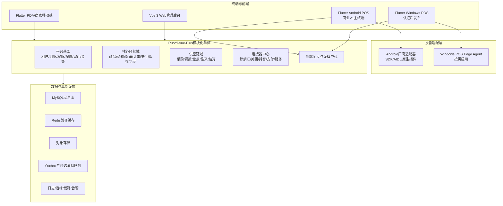

# 连接器型商业收银经营平台

## 技术架构与开发规范 V1.0

> 技术基线：RuoYi-Vue-Plus + Vue 管理后台 + Flutter Android 优先 POS/移动端 + 可选 Windows POS Edge Agent

---

# 文档说明

## 1. 文档目的

本文是研发、测试、DevOps、实施和技术合作方共同遵循的技术基线，用于回答以下问题：

- 系统采用什么总体架构、技术栈和部署方式。
- RuoYi-Vue-Plus 可以复用什么，哪些核心领域必须自研。
- Flutter 如何同时支撑 Android POS、Windows POS、PDA 和商家移动端。
- Android 商用收银硬件如何接入、认证、升级和远程诊断。
- 多租户、订单、支付、库存和离线同步如何保证商业可靠性。
- 代码、数据库、API、事件、测试、发布和 AI 辅助研发应遵循什么规范。

本文不替代领域规格。订单、支付、退款、库存、促销、连接器和离线同步仍应分别形成详细设计说明书。

## 2. 文档控制

| 项目 | 内容 |
|---|---|
| 文档版本 | V1.0 |
| 基线日期 | 2026-08-15 |
| 状态 | 建议作为架构评审基线 |
| 首发终端 | Android 商用 POS 一体机 |
| 兼容终端 | Android PDA/移动端；Windows POS 后续认证 |
| 服务端基线 | RuoYi-Vue-Plus 5.6.x 系列，实施前固定具体 Tag 和内部 Fork |
| 架构形态 | 模块化单体优先，事件驱动扩展，达到拆分门槛后再微服务化 |

## 3. 规范级别

| 级别 | 含义 |
|---|---|
| 必须 | 不符合不得合并或发布 |
| 应当 | 原则上必须符合，例外需 ADR 和负责人批准 |
| 可以 | 按实际场景选择，不形成强制约束 |

---

# 一、技术选型结论

## 1.1 最终选型

1. 服务端采用 RuoYi-Vue-Plus 作为 SaaS 平台基础和管理后台底座。
2. 服务端首期采用模块化单体，不采用 RuoYi-Cloud-Plus 微服务版。
3. Web 总部、商户和运营管理后台保留 Vue 3 + TypeScript。
4. POS、PDA 和商家移动端采用 Flutter，共享设计系统、协议模型和通用业务组件。
5. 商业 V1 以 Android 商用 POS 一体机为唯一正式收银终端路线。
6. Windows 由 Flutter 保留编译能力，但只有通过完整硬件认证后才成为正式产品。
7. Android 内置打印、扫码、钱箱、客显等能力通过厂商 SDK/AIDL/原生插件适配，不强制部署 Edge Agent。
8. Windows 遇到 USB、串口、COM、厂商支付 SDK 或复杂打印场景时，使用可选 POS Edge Agent。
9. 本地交易采用 SQLite、本地事务、Outbox 和幂等同步；云端短时故障不得阻断允许离线的营业。
10. 核心业务以领域模型、状态机、账本和不可变快照实现，不以通用 CRUD 代替业务设计。

## 1.2 对“Flutter 是否够用”的判断

Flutter 足以承担 Android 商用 POS 的收银界面、本地数据、离线营业、同步和常规硬件接入，但成立的前提是：

- 只支持硬件白名单，不承诺任意 Android 收银机都能运行。
- 每个厂商 SDK 通过统一设备接口接入，业务代码不直接调用厂商 API。
- 不依赖 Google Play Services，适配国内商用 Android 环境。
- 收银交易和同步不能只存内存或普通键值存储，必须使用可靠本地数据库。
- 发布前必须完成真机、断电、断网、长稳、升级回滚和外设插拔测试。

“一套 Flutter 代码”指共享 UI、领域模型和通用逻辑，不代表 Android、Windows 的驱动代码完全相同。

## 1.3 明确不采用的方案

- V1 不采用全量微服务、Service Mesh 和复杂 Kubernetes 平台作为前置条件。
- 不用 Flutter Web 替换若依 Vue 管理后台。
- 不让 RuoYi 代码生成器生成订单、支付、库存、促销等核心领域逻辑。
- 不让 POS UI 直接访问打印机、支付 SDK 或数据库表。
- 不依赖未经审计的单一社区硬件插件作为商用关键路径。
- 不同时发布 Android 和 Windows 两条未经充分认证的 POS 产品线。

---

# 二、总体架构

## 2.1 逻辑架构



## 2.2 分层职责

| 层级 | 职责 | 禁止事项 |
|---|---|---|
| Flutter 表现层 | 页面、交互、可访问性、状态展示 | 不写金额、库存、支付状态机规则 |
| Flutter 应用层 | 用例编排、权限检查、事务边界、同步调度 | 不依赖具体厂商硬件 API |
| Flutter 领域层 | 本地订单、班次、支付引用、离线规则 | 不依赖 Flutter Widget、HTTP、SQLite 实现 |
| 设备适配层 | 打印、扫码、称重、钱箱、客显、支付终端 | 不判断促销、订单和库存业务规则 |
| 服务端接口层 | 鉴权、参数校验、协议转换、限流 | 不承载核心业务逻辑 |
| 服务端应用层 | 命令、查询、事务、领域协作 | 不跨领域直接修改数据库表 |
| 服务端领域层 | 聚合、状态机、账本、不变量、领域事件 | 不依赖 Controller、MyBatis、Redis、第三方 SDK |
| 基础设施层 | 数据持久化、消息、缓存、外部接口实现 | 不反向定义领域规则 |

## 2.3 部署形态

### 标准 SaaS

- 模块化单体应用可多实例部署。
- MySQL 主从或托管高可用数据库。
- Redis 仅用于缓存、限流、短期锁和会话辅助。
- 对象存储保存导入文件、小票、诊断包和受控原始报文。
- Nginx/API 网关负责 TLS、路由、基础限流和安全头。

### 企业专属或私有化

- 保持同一代码基线，通过配置和部署清单差异化。
- 不允许为单一客户长期维护不可合并的核心分支。
- 明确数据库、备份、证书、监控、安全补丁和升级责任。

---

# 三、技术栈基线

## 3.1 服务端

| 类别 | 选型 | 规则 |
|---|---|---|
| 基础框架 | RuoYi-Vue-Plus 5.6.x 系列 | 固定 Tag、建立内部 Fork，不直接跟随主分支上线 |
| Java | 遵循所选 RuoYi 版本的 Java 17 编译基线 | 如升级 JDK 21，必须完成依赖、性能和全量回归验证 |
| Web框架 | Spring Boot 3.5.x 基线 | 不在商业V1强升 Spring Boot 4 |
| 持久化 | MyBatis-Plus + 显式 Mapper/Repository | 核心查询必须审查 SQL 和租户条件 |
| 数据库 | MySQL 8.4 LTS 或经认证的兼容版本 | InnoDB、utf8mb4、严格 SQL 模式 |
| 数据迁移 | Flyway | 迁移脚本纳入版本库且只前进发布 |
| 缓存 | Redis 兼容服务 | 不作为订单、库存、支付的唯一事实来源 |
| 异步可靠性 | 数据库 Outbox 为必选；消息队列按容量引入 | 首期不得为“架构先进”而滥用 MQ |
| 文件 | S3 兼容对象存储 | 私有桶、短时授权、病毒与格式检查 |
| 接口文档 | OpenAPI 3 | 文档由代码/契约生成并纳入兼容性检查 |
| 可观测性 | OpenTelemetry + 指标/日志/链路平台 | 统一 Trace ID、租户和业务标识脱敏记录 |

## 3.2 Web 管理后台

| 类别 | 选型与规范 |
|---|---|
| 框架 | 使用 RuoYi-Vue-Plus 配套 Vue 3 + TypeScript 前端 |
| UI | 保持配套 UI 技术路线，建立本产品主题和设计 Token |
| 状态 | 只存 UI 和会话状态，不在浏览器保存敏感业务事实 |
| 权限 | 路由权限只负责展示；最终授权必须由服务端执行 |
| API | 从 OpenAPI 生成或统一封装客户端，禁止页面散写请求格式 |

## 3.3 Flutter 终端

| 类别 | 推荐基线 | 规则 |
|---|---|---|
| SDK | Flutter Stable 固定版本 | SDK 与依赖锁定，按季度评估升级 |
| 目标平台 | Android 优先；Windows 兼容 | Android 正式发布，Windows 经认证后发布 |
| 状态管理 | Riverpod 系列或项目统一批准方案 | 只允许一种主状态管理方案，不混用多套范式 |
| 路由 | go_router 或统一封装 | 路由权限不代替业务授权 |
| 网络 | Dio 或统一 HTTP Client | 统一超时、重试、签名、证书和错误映射 |
| 本地数据库 | SQLite + Drift/等价成熟封装 | 交易表、Outbox 和迁移必须使用事务 |
| 模型 | 不可变模型 + JSON 代码生成 | 云端 DTO、本地实体、领域模型分离 |
| 安全存储 | Android Keystore/Windows 安全存储封装 | Token、设备私钥不得明文落库 |
| 原生调用 | Pigeon/Platform Channel/FFI 统一封装 | UI 和业务层禁止直接调用 MethodChannel |
| 崩溃与诊断 | 可替换的 Crash/Log Adapter | 日志脱敏、用户授权上传、支持离线缓存 |

所有第三方包必须经过活跃度、许可证、维护者、平台支持、已知漏洞和替换成本评审；关键链路应当有自有接口和可替换实现。

---

# 四、服务端架构规范

## 4.1 RuoYi 的使用边界

RuoYi-Vue-Plus 主要复用：

- 租户生命周期和租户套餐基础能力。
- 用户、角色、部门、岗位、菜单和数据权限。
- 登录、审计、字典、参数、文件和后台任务基础设施。
- Web 管理后台、通用查询和辅助资料页面。

以下部分必须自研且不得与若依通用模块混写：

- 商品与主数据、价格、促销。
- POS 订单、支付、退款、班次、交班。
- 库存账本、预占、成本和盘点。
- 采购、调拨、加盟订货、往来结算。
- 会员积分、优惠券、储值账本。
- 终端同步、设备协议和连接器运行时。

## 4.2 模块建议

```text
server/
├─ ruoyi-admin/                     应用启动与管理接口装配
├─ ruoyi-common/                    若依公共能力，谨慎修改
├─ platform-modules/                租户、IAM、审计、配置、订阅
├─ pos-modules/
│  ├─ pos-masterdata/               商品、条码、单位、供应商基础资料
│  ├─ pos-pricing/                  价格、促销、优惠分摊
│  ├─ pos-order/                    销售订单、退货、班次
│  ├─ pos-payment/                  支付、退款、撤销、对账
│  ├─ pos-inventory/                库存账本、预占、成本、盘点
│  ├─ pos-procurement/              采购、调拨、补货
│  ├─ pos-member/                   会员、积分、券、储值引用
│  ├─ pos-settlement/               往来、加盟和供应商结算
│  ├─ pos-device/                   终端、版本、配置、诊断
│  └─ pos-sync/                     数据包、Outbox接收、冲突处理
├─ integration-modules/
│  ├─ connector-runtime/            连接器运行时和标准数据契约
│  └─ connector-*/                  鲸熵汇、美团、支付、财务等适配器
└─ architecture-tests/              模块依赖和租户隔离测试
```

具体目录可以适配 RuoYi 上游结构，但领域边界、依赖方向和所有权不得改变。

## 4.3 单模块分层

```text
com.company.pos.order
├─ interfaces       Controller、请求/响应DTO、消息入口
├─ application      Command、Query、用例服务、事务编排
├─ domain           聚合、实体、值对象、领域服务、事件、仓储接口
└─ infrastructure   MyBatis、Repository实现、消息、外部服务适配
```

依赖方向必须为 `interfaces -> application -> domain`，`infrastructure -> domain`。领域层不得依赖 RuoYi BaseEntity、MyBatis 注解、Spring Controller 或第三方 SDK。

## 4.4 事务与一致性

- 一个本地事务只能修改一个领域模块拥有的交易表。
- 跨领域使用应用编排和事件，不直接跨模块更新表。
- 订单、支付、退款、库存分别维护独立状态机，不合并为单一状态字段。
- 领域状态和 Outbox 事件必须在同一本地事务提交。
- 消费者按 `event_id` 幂等处理，允许重复投递，禁止假设“消息只来一次”。
- 外部支付和连接器调用不得放在长数据库事务内。
- 未知支付状态必须查询确认，不得自动再次扣款。
- 库存使用账本流水表达变化，禁止只修改余额而不留来源流水。

## 4.5 缓存规范

- 缓存必须可以从数据库或受控数据包重建。
- Key 必须包含环境、租户、业务域、对象标识和版本。
- 禁止使用通配符批量删除生产缓存。
- 缓存穿透、击穿和雪崩必须有空值、互斥或随机过期策略。
- 金额、支付最终状态和库存账本不得仅存在缓存中。

---

# 五、Flutter 客户端架构规范

## 5.1 产品拆分

Flutter 采用共享代码包、独立应用壳的方式，避免一个 App 包含所有角色和页面：

```text
client/
├─ apps/
│  ├─ pos_app/                      Android POS；后续启用Windows构建
│  ├─ pda_app/                      收货、盘点、调拨、拣货
│  └─ merchant_app/                 店长和老板移动端
├─ packages/
│  ├─ design_system/                颜色、字体、间距、控件和无障碍
│  ├─ domain_models/                跨端共享值对象和领域类型
│  ├─ api_contract/                 API DTO、错误码和版本
│  ├─ local_store/                  SQLite、迁移和事务封装
│  ├─ sync_engine/                  Outbox、Inbox、游标和冲突
│  ├─ device_contract/              设备抽象和能力模型
│  ├─ auth_session/                 登录、设备身份、离线授权
│  ├─ observability/                日志、指标、崩溃和诊断
│  └─ feature_*/                    可复用业务功能
└─ native/
   ├─ android_vendor_*/             各硬件厂商适配实现
   └─ windows_edge_contract/        Windows Edge Agent协议
```

## 5.2 应用分层

- `presentation`：页面、Widget、输入和状态展示。
- `application`：销售、挂单、结算、退货、交班等用例。
- `domain`：金额、数量、订单行、支付状态、本地规则和不变量。
- `data`：Repository、SQLite、HTTP、同步和设备实现。

Widget 不得包含 SQL、HTTP、打印指令、金额舍入和库存规则。状态管理对象不得演变为万能业务服务。

## 5.3 Android 运行基线

- 新采购认证硬件应当为 ARM64、Android 11 及以上、4GB RAM、32GB 可用存储或更高配置。
- Android 9/10 只作为已认证存量硬件的兼容档，不作为新采购默认标准。
- 不假设设备具备 Google 服务。
- 必须验证横屏、竖屏、触摸、物理键、输入法、扫码广播和外接键盘。
- POS 应支持开机自启、前台保活、Kiosk/锁定任务模式或厂商等价能力。
- 必须适配系统时间异常、存储不足、低电量、休眠唤醒和应用被系统回收。
- 屏幕适配以 8 至 15.6 英寸商用终端为基线，关键收银操作不得依赖细小点击区域。

## 5.4 本地数据与离线

### 本地数据分类

| 数据 | 是否本地保存 | 说明 |
|---|---|---|
| 商品、条码、价格、确定性促销 | 是 | 版本化数据包，下发后原子切换 |
| 员工离线授权快照 | 是 | 有有效期和撤销策略 |
| 班次、订单、现金支付、打印任务 | 是 | 使用数据库事务持久化 |
| 电子支付敏感凭证 | 最小化 | 只保存受控引用，不保存支付密钥和敏感卡数据 |
| 会员敏感资料 | 最小化 | 脱敏缓存，按需查询和到期清理 |
| 日志与诊断 | 是 | 限额、脱敏、循环覆盖、授权上传 |

### 数据库规则

- SQLite 使用 WAL 和明确事务边界；关键提交采用经验证的持久化参数。
- 订单、订单行、支付引用、库存影响、打印任务和 Outbox 应在一次本地事务中记录。
- SharedPreferences/普通 Key-Value 存储不得保存交易事实。
- 每个迁移脚本必须支持从所有仍受支持的历史版本升级。
- 升级前创建受控备份或恢复点，迁移失败不得启动营业界面。
- 数据库损坏必须进入安全恢复流程，不得静默清空重建。

### 离线能力边界

- 离线允许：本地登录（有效授权期内）、开班、扫码、确定性促销、现金销售、挂单、打印和交班暂存。
- 离线默认禁止：普通聚合码支付、银行卡联机支付、储值扣款、券实时核销、会员余额修改和需要云端审批的操作。
- 支付机构明确提供合规离线能力时，必须单独评审和实现，不得默认开启。
- 离线界面必须清晰显示网络状态、受限功能、待同步数量和最后同步时间。

## 5.5 同步引擎

- 每个终端拥有不可变 `device_id`、本地事件序列和服务端同步游标。
- 上行按 Outbox 顺序发送；每条记录具有全局 ID、聚合版本和幂等键。
- 服务端返回逐条接收结果，不以 HTTP 200 代表全部业务成功。
- 下行采用版本包或增量游标；数据包校验摘要和签名后原子启用。
- 冲突按对象类型制定规则，禁止通用“最后写入覆盖”。
- 已支付订单、库存流水、积分和储值账本不得由客户端覆盖服务端事实。
- 崩溃重启从未确认 Outbox 继续；重复上传不得重复生成订单、支付或库存流水。

## 5.6 UI 与交互规范

- Android POS 以横屏、触摸、扫码连续操作为主，PDA 以竖屏、单手扫描为主。
- 扫码到商品进入购物车应当本地完成，不依赖实时云端响应。
- 支付中的页面必须阻止重复提交，但不得阻止状态查询和异常恢复。
- 危险操作显示影响范围、金额和原因，退款、抹零、改价等受权限控制。
- 所有异步操作必须有进行中、成功、失败、未知和可恢复状态。
- 错误提示应告诉收银员下一步动作，不展示堆栈、SQL、HTTP 状态或内部异常。
- 关键操作支持物理键、扫码枪回车和无鼠标流程。

---

# 六、设备适配与 Edge Agent 规范

## 6.1 统一设备接口

设备能力必须通过稳定接口暴露：

```text
ScannerPort
ReceiptPrinterPort
LabelPrinterPort
ScalePort
CashDrawerPort
CustomerDisplayPort
PaymentTerminalPort
DeviceHealthPort
```

每个接口至少定义：能力发现、连接状态、执行命令、超时、错误分类、重试安全性、诊断信息和版本。

## 6.2 Android 适配方式

优先级如下：

1. 厂商官方 Flutter 插件且完成代码、许可证和真机审计。
2. 自研 Kotlin 原生插件封装厂商 SDK/AIDL 服务。
3. 标准蓝牙、USB Host、串口或网络协议适配。
4. 无可靠 SDK 或驱动的设备不进入认证白名单。

厂商 SDK 只能存在于 `android_vendor_*` 适配模块。上层只依赖统一设备契约。

## 6.3 Windows Edge Agent

Windows Edge Agent 是可选组件，不是 Android POS 的前置条件。以下场景启用：

- 厂商仅提供 Windows COM/.NET/C++ SDK。
- 需要 Windows 打印队列、USB/串口驱动和钱箱联动。
- 需要独立进程隔离打印或支付终端崩溃。
- 需要系统级升级、诊断和设备服务常驻。

Agent 与 Flutter 通过受保护的本地 IPC 通信，只监听本机；协议必须鉴权、版本化、限流并防止任意命令执行。

## 6.4 打印可靠性

- 付款成功与打印成功是两个独立状态，打印失败不得回滚已成功支付。
- 打印任务先持久化再执行，拥有任务 ID、模板版本、重试次数和结果。
- 补打必须标记“补打”并记录操作人、时间和原因。
- 钱箱开启命令与允许的支付方式和权限绑定。
- 模板变更必须保留版本，历史订单按原始快照可重建。

## 6.5 硬件认证

每个认证组合至少测试：

- 连续扫码、重复条码、称重稳定性和异常重量。
- 缺纸、开盖、卡纸、断电、拔插、蓝牙断开和网络打印超时。
- 钱箱、客显、双屏、外接键盘和输入法。
- 72 小时长稳、应用崩溃恢复、系统重启和低存储。
- APK 灰度升级、失败回滚、数据库迁移和配置回退。

未经认证的硬件可以进入实验室验证，不得在合同中承诺正式支持。

---

# 七、多租户与身份安全规范

## 7.1 租户模型

租户、集团、品牌、区域、加盟商、组织、门店、仓库、终端必须分开建模。`tenant_id` 是 SaaS 隔离边界，门店和组织是租户内部的数据范围，二者不得混用。

## 7.2 强制隔离措施

- 所有租户业务表必须包含 `tenant_id`，并进入唯一键和常用索引。
- MyBatis 租户拦截器是防御层，不是唯一隔离手段。
- Token 中的租户、用户、终端和门店绑定必须由服务端签发和验证。
- 不得直接相信客户端提交的 `tenant_id` 或 `X-Tenant-Id`。
- Redis Key、对象路径、Outbox、定时任务、批处理和日志上下文必须携带租户。
- 后台异步任务必须显式枚举授权租户，不得使用缺省租户上下文。
- 跨租户运营功能使用独立平台身份、强审计和最小权限。
- CI 必须覆盖 Mapper XML、原生 SQL、批量导出、后台任务和缓存的租户逃逸测试。

## 7.3 身份类型

| 身份 | 认证方式 | 说明 |
|---|---|---|
| 管理后台用户 | Sa-Token/统一认证 + MFA策略 | 高权限用户必须加强认证 |
| POS设备 | 设备激活凭证 + 设备私钥/证书 | 与租户、门店、终端记录绑定 |
| 收银员工 | 在线令牌；离线使用有效期授权快照和PIN | 离线权限必须可过期和撤销 |
| 开放平台应用 | Client Credential、签名、IP/权限范围 | 与普通用户身份隔离 |
| 连接器 | 独立密钥和授权记录 | 每租户、每环境隔离 |

## 7.4 敏感数据

- 密码使用强单向哈希，不可逆加密。
- 手机、证件、地址、密钥、支付引用和原始报文按字段分类分级。
- 日志默认脱敏，不记录密码、完整令牌、支付密钥和完整身份证号。
- 设备私钥存入 Android Keystore 或 Windows 安全存储。
- 本地敏感数据库根据威胁模型使用 SQLCipher 或字段加密。
- 数据导出需权限、原因、水印、审计和有效期控制。

---

# 八、数据库与领域数据规范

## 8.1 标识与时间

- RuoYi平台记录主键（`sys_tenant.id`、用户、部门、角色等）沿用框架的 `BIGINT`；业务隔离字段`tenant_id`沿用框架的`VARCHAR(20)`租户编号，避免侵入式修改平台底座。
- 离线可创建的业务实体统一使用 ULID 作为全局主标识；不得依赖联网后才生成 ID。
- 可读订单号、支付流水号和单据号是业务编号，不作为数据库主键。
- 时间存储使用 UTC `datetime(3)`，接口使用 ISO 8601 带时区格式。
- 业务日期、班次日期和自然时间分开保存，日结不得仅按服务器零点判断。

## 8.2 金额与数量

- 订单应收、实收、退款、优惠等结算金额使用最小货币单位整数，并保存币种。
- 单价、成本、税率和中间计算使用 `DECIMAL`/Java `BigDecimal`，禁止 `float/double`。
- 数量使用 `DECIMAL(19,6)` 或经领域确认的统一精度。
- 优惠分摊必须保证分摊合计等于原优惠，尾差规则固定并可重放。
- 订单必须满足：商品原价合计 - 优惠合计 + 附加金额 = 应收金额；支付净额与订单结算状态一致。

## 8.3 表设计

- 表名前缀体现领域，例如 `ord_`、`pay_`、`inv_`、`prd_`、`mbr_`。
- 核心表至少包含 `id`、`tenant_id`、`created_at`、`updated_at`、`version`。
- 乐观锁字段用于并发控制，不能把乐观锁失败自动覆盖为成功。
- 订单、支付、退款、库存、积分、储值等账本禁止物理删除和随意修改。
- 软删除仅用于适合删除的主数据；交易数据使用撤销、冲正、关闭等业务动作。
- JSON 字段只用于低频扩展和原始快照，不替代明确的核心字段和索引。
- 所有外键关系即使不建立物理外键，也必须在模型、索引和测试中保证引用完整性。

## 8.4 数据库迁移

- Flyway 脚本一经进入共享环境不得修改内容，只能新增修复脚本。
- 采用 Expand-Migrate-Contract：先新增兼容结构，再迁移数据，最后在后续版本删除旧结构。
- 同一发布中禁止直接重命名或删除仍被旧 POS 版本访问的字段。
- 大表迁移必须评估锁表、复制延迟、执行时长和中断恢复。
- 每次迁移必须在生产数据规模副本或等量模拟数据上验证。

---

# 九、API、事件与连接器规范

## 9.1 API 分区

```text
/api/admin/v1/*       Web管理后台
/api/pos/v1/*         POS与PDA终端
/openapi/v1/*         外部开放平台
/webhooks/v1/*        外部回调入口
/internal/v1/*        受控内部接口，不对公网开放
```

## 9.2 API 规则

- 使用 JSON、UTF-8、HTTPS，时间使用 ISO 8601，金额遵循统一金额对象。
- 写接口必须支持 `request_id`；可重试操作必须支持 `idempotency_key`。
- POS 请求必须携带服务端验证的设备身份、应用版本和协议版本。
- 列表采用游标或稳定分页；不得对变化数据依赖不稳定页码同步。
- 错误响应包含稳定错误码、用户可理解消息、是否可重试和 Trace ID。
- HTTP 状态表示协议结果，业务错误码表示业务原因，二者不得互相替代。
- 删除、退款、撤销、调价和库存调整必须记录原因与审计信息。
- 新字段默认向后兼容；删除或改变语义必须发布新版本并经过弃用期。

## 9.3 事件规范

所有领域和集成事件至少包含：

```json
{
  "event_id": "01...ULID",
  "event_type": "order.paid.v1",
  "aggregate_id": "01...ULID",
  "aggregate_version": 3,
  "tenant_id": "1000001",
  "occurred_at": "2026-08-15T10:30:00.000+08:00",
  "trace_id": "...",
  "producer": "pos-order",
  "payload": {}
}
```

- 事件名称必须包含版本。
- 事件表达已经发生的事实，不使用含糊的“处理数据”命名。
- 消费者只能修改自身领域数据。
- 事件 Schema 必须做契约测试，新增字段向后兼容。
- 原始第三方报文受控保存，标准事件不泄漏第三方私有字段。

## 9.4 连接器边界

- 鲸熵汇、美团、抖音、京东、淘宝闪购、支付和财务软件均作为连接器。
- 连接器只依赖标准数据契约，不直接访问其他领域数据库表。
- 每个连接器独立授权、映射、限流、重试、死信、补偿、对账和版本管理。
- 回调先验签、去重和保存原始事实，再异步转换和处理。
- 连接器失败不得阻断 POS 本地现金收银核心链路。

---

# 十、编码规范

## 10.1 通用规则

- 代码、类名、字段名使用英文；业务文档、注释可以使用中文。
- 名称必须表达领域含义，禁止 `data1`、`flag2`、`handleBiz` 等模糊命名。
- 一个函数只做一个层级的事情；复杂状态变化使用明确命令和状态机。
- 禁止复制粘贴支付、金额、优惠、权限和租户判断。
- 不允许吞异常、空 Catch 或只打印日志后假装成功。
- 所有外部依赖必须配置连接、读取和总超时，并明确是否可重试。
- 重试必须有上限、退避、抖动和幂等条件。
- 核心规则变更必须同步更新规格、测试和 ADR/变更记录。

## 10.2 Java 规范

- Controller 只做鉴权上下文、参数校验、DTO 转换和调用应用服务。
- 应用服务负责用例和事务；领域对象负责不变量和状态迁移。
- Repository 接口定义在领域层，实现位于基础设施层。
- 禁止 Controller 直接调用 Mapper。
- 禁止核心领域对象继承 RuoYi 通用 BaseEntity。
- DTO、Command、Domain Model 和 Persistence Object 必须分离。
- 核心金额使用值对象封装，不在业务代码散写 BigDecimal 舍入。
- 使用 Bean Validation 处理格式约束，领域层再次检查业务不变量。
- 使用 Spotless/统一格式化、静态分析、ArchUnit 和依赖漏洞扫描。
- 对公共方法、状态机、外部契约和非显然算法编写有效注释；不写重复代码含义的注释。

## 10.3 Flutter/Dart 规范

- 必须通过 `dart format` 和 `flutter analyze`，警告不得带入主分支。
- 页面按 Feature 组织，不建立巨大 `utils`、`common` 或万能 Service。
- Widget 保持无业务副作用；数据库、HTTP 和设备调用通过 Use Case/Repository。
- 状态对象不可变；禁止到处使用全局可变单例。
- `BuildContext` 不跨异步边界长期持有。
- 所有 Stream、Controller、监听和原生资源必须正确释放。
- 网络和数据库异常统一映射为领域错误，不向 UI 泄漏底层异常。
- 关键页面必须覆盖加载、空数据、失败、离线、未知结果和重试状态。
- Platform Channel 只在原生适配包内出现，并配套模拟实现和契约测试。

## 10.4 SQL 规范

- 禁止 `SELECT *`；明确字段并审查执行计划。
- 所有租户查询必须具备租户条件；关键查询将租户字段置于联合索引前部的合理位置。
- 禁止无条件全表更新和删除。
- 批量写入限制单批大小，并有失败重试和幂等策略。
- 模糊查询、报表和导出不得拖慢交易库；达到阈值后使用只读副本或分析库。
- 生产 SQL 变更必须随版本迁移发布，不通过人工临时改表代替。

## 10.5 Git 与评审

- 使用主干开发和短生命周期分支，主分支始终保持可发布。
- 提交信息遵循统一约定并关联需求或缺陷编号。
- 禁止直接推送主分支；必须通过 Pull Request、CI 和至少一名非作者评审。
- 支付、退款、库存、租户、安全和数据库迁移需要领域负责人或指定 CODEOWNER 评审。
- 大功能使用 Feature Flag，未完成功能不得以长期分支隔离。
- 每个 PR 应当保持单一目的，包含变更说明、风险、测试证据和回滚说明。

---

# 十一、测试与质量门禁

## 11.1 测试分层

| 类型 | 重点 |
|---|---|
| 单元测试 | 金额、数量、促销、状态机、账本、不变量和权限规则 |
| 属性测试 | 金额守恒、优惠分摊、库存守恒、重复消息幂等 |
| 集成测试 | MySQL事务、Flyway、Redis、Outbox、支付沙箱、连接器沙箱 |
| 契约测试 | OpenAPI、事件Schema、设备接口、连接器标准模型 |
| 端到端测试 | 开班、扫码、促销、支付、打印、退货、交班、同步 |
| 故障注入 | 断网、断电、超时、重复回调、乱序、应用被杀和存储不足 |
| 安全测试 | 租户越权、水平越权、注入、重放、签名、敏感数据和依赖漏洞 |
| 实机测试 | 每套硬件白名单的完整回归、长稳和升级 |

## 11.2 覆盖标准

- 核心领域模块分支覆盖率应达到 85% 以上。
- 普通模块不以单一覆盖率代替质量，但新增代码必须有与风险匹配的测试。
- 订单、支付、退款、库存、优惠分摊和同步的状态迁移必须实现规格中的全部合法与非法路径。
- 每个生产缺陷必须补充可复现的自动化测试或说明为何只能实机覆盖。

## 11.3 Android POS 发布门禁

- 认证硬件上连续运行 72 小时无崩溃、无订单丢失和不可恢复资源泄漏。
- 强杀进程、系统重启和断电后，已提交订单和待同步数据完整恢复。
- 同一 Outbox 重放多次不产生重复订单、支付或库存流水。
- 打印机断开、缺纸和恢复后任务可追踪、可补打、不改变支付结果。
- APK 升级失败可以回滚；数据库迁移失败不会破坏原交易数据。
- 离线能力和限制与产品界面、培训手册和验收用例一致。

## 11.4 性能基线

- 本地扫码到商品入行的 P95 目标不超过 150ms，不含硬件解码时间。
- 本地购物车常规操作不得依赖云端接口。
- 在线核心写 API 在基准负载下 P95 目标不超过 500ms，第三方支付等待单独统计。
- 单终端支持不少于 7 天离线数据缓存和待同步空间，具体上限按门店模型压测确认。
- 批量下发、日结和报表不得抢占核心交易资源。

性能指标是初始工程门槛，G1 PoC 后应按真实硬件和门店交易量修订。

---

# 十二、CI/CD 与发布规范

## 12.1 服务端流水线

流水线至少包含：

1. 格式化和静态检查。
2. 单元测试和架构边界测试。
3. 集成测试、Flyway 空库/升级测试。
4. OpenAPI 和事件契约兼容性检查。
5. 依赖漏洞、许可证、密钥和镜像扫描。
6. 构建不可变制品、生成 SBOM 并签名。
7. 部署集成环境，执行端到端测试。
8. 预生产验证、数据库备份检查和灰度发布。
9. 自动健康检查；失败时停止扩散并执行回滚/前向修复。

## 12.2 Flutter 流水线

- 固定 Flutter SDK、Dart SDK、Gradle、JDK 和依赖锁文件。
- 执行格式化、分析、单元、Widget、集成和设备契约测试。
- Android 按环境和渠道使用独立 Flavor，不通过运行时手工改地址。
- APK/AAB 使用受控签名密钥，构建产物生成校验摘要和 SBOM。
- 版本号由 CI 产生且单调递增；服务端维护协议和最低支持版本。
- 采用内测、试点门店、小比例灰度、区域灰度、全量发布顺序。
- 强制升级只用于安全、协议不兼容或重大缺陷，并提供营业时段保护。

## 12.3 配置与密钥

- 配置按环境管理，禁止把生产密钥、支付证书和连接器凭证提交到仓库。
- Feature Flag 具有负责人、范围、默认值、启停审计和清理日期。
- 支付、连接器和签名密钥支持轮换，不因轮换要求全量停机。
- 客户端只包含公开配置和公钥，不包含服务端密钥。

---

# 十三、可观测性与运维规范

## 13.1 统一关联标识

请求、订单、支付、退款、同步、打印和连接器统一关联以下标识：

- `trace_id`
- `tenant_id`
- `store_id`
- `device_id`
- `business_date`
- `order_id`/`payment_id` 等业务标识

敏感标识在日志平台显示时必须脱敏或受权限控制。

## 13.2 核心指标

- POS 在线率、版本分布、最后心跳、磁盘空间和待同步数量。
- 订单成功率、未知订单数、同步延迟和冲突数量。
- 支付成功率、未知支付率、退款失败率和对账差异。
- 打印成功率、平均重试次数和各型号硬件故障率。
- API 延迟、错误率、数据库连接、慢 SQL、缓存命中和 Outbox 积压。
- 连接器回调延迟、重试、死信、授权过期和平台限流。

## 13.3 诊断包

终端诊断包应当包含版本、设备能力、配置摘要、最近脱敏日志、数据库健康、同步游标和外设状态，不包含明文密码、令牌、支付密钥和不必要的会员信息。上传必须由用户授权或按合同中的受控远程支持策略执行。

## 13.4 灾备

- 明确生产数据库 RPO/RTO，并按季度验证恢复演练。
- 备份必须加密、异地保存、定期恢复验证，不以“备份任务成功”代替可恢复性。
- 终端离线数据不能代替云端备份，云端备份也不能代替 POS 本地恢复机制。
- 严重事件必须有 Runbook、值班升级和复盘改进。

---

# 十四、AI 辅助开发规范

## 14.1 可使用场景

- 普通后台页面、DTO、接口样板和低风险 CRUD。
- 单元测试、契约测试、异常场景和设备模拟器初稿。
- 数据迁移工具、日志分析、文档和代码解释。
- 在既定状态机、表结构和协议下生成实现草案。

## 14.2 强制限制

- AI 不得自行决定金额口径、支付状态、库存扣减、促销叠加、租户边界和安全策略。
- AI 生成的数据库迁移、支付、退款、库存、权限和加密代码必须由对应负责人评审。
- AI 不得接触生产密钥、完整生产数据、支付敏感报文和未脱敏会员数据。
- AI 生成代码不得直接合并或发布，必须经过同等 CI、测试和人工审查。
- 需求、状态机、数据契约不明确时，先补规格，不允许通过反复生成代码碰运气。

## 14.3 AI 变更清单

每个 AI 辅助 PR 应回答：

- 使用了哪一份已批准规格。
- 哪些代码由 AI 生成或大幅改写。
- 人工验证了哪些不变量和异常路径。
- 新增了哪些自动化测试。
- 是否引入新依赖、许可证或数据安全风险。
- 如何回滚或关闭该功能。

---

# 十五、研发流程与 Definition of Done

## 15.1 需求进入开发前

- 具备需求 ID、范围、非目标和验收标准。
- 核心业务具备状态机、不变量、权限和审计要求。
- 涉及跨模块时明确数据主权、API/事件契约和失败补偿。
- 涉及设备时明确认证型号、厂商 SDK、测试设备和替代方案。
- 涉及数据库时明确迁移、兼容、容量和回滚/前向修复方案。

## 15.2 完成定义

功能只有同时满足以下条件才算完成：

- 代码符合模块边界和编码规范。
- 单元、集成、契约、端到端或实机测试与风险匹配。
- 权限、租户、审计、幂等、日志脱敏和异常恢复已覆盖。
- API、事件、数据库迁移和用户文档已更新。
- 监控指标、告警和 Runbook 已补充。
- 兼容性、灰度、回滚和数据修复方案已验证。
- 产品、研发、测试和必要的实施人员完成验收。

## 15.3 禁止上线清单

出现以下任一情况不得上线：

- 存在未接受的严重/高危漏洞或已知租户越权。
- 支付未知状态会触发自动重复扣款。
- 订单、支付或库存没有幂等和故障恢复验证。
- 数据库迁移未在历史版本和生产等量数据上测试。
- Android 主认证机型未完成打印、扫码、断电和长稳回归。
- 客户端升级无法回滚或会破坏本地交易数据。
- 无监控、无负责人、无故障处理手册的关键能力。

---

# 十六、技术实施阶段与门禁

| 阶段 | 建议周期 | 核心技术交付 | 通过门槛 |
|---|---:|---|---|
| T0 技术基线 | 2周 | 固定RuoYi/Flutter版本、仓库结构、CI、ADR、编码模板 | 可重复构建；依赖和许可证审计完成 |
| T1 风险PoC | 3至4周 | Android扫码/打印/称重、SQLite/Outbox、租户隔离、支付沙箱 | 断网断电、重复同步、硬件恢复和越权测试通过 |
| T2 核心Alpha | 10至14周 | 商品、价格、POS、订单、现金/主支付、退款、班次、库存基础 | 实验室端到端闭环，无架构级阻断 |
| T3 商用加固 | 8至10周 | 监控、灰度、升级回滚、迁移、对账、诊断、硬件认证 | 72小时长稳、故障注入和安全基线通过 |
| T4 设计伙伴 | 8至12周 | 3至5家门店影子运行、双轨核对、受控切换 | 每店稳定运行60天，订单零丢失，支付差异闭环 |
| T5 商业V1 | 按门禁 | 标准Android POS、Vue后台、实施包、SLA和认证BOM | 标准门店可复制交付，服务成本进入目标范围 |
| T6 平台扩展 | 商业V1后 | Windows认证、PDA增强、更多连接器和供应链能力 | 每项有付费需求、容量和维护成本依据 |

## 16.1 T1 必须验证的硬问题

1. Android 主力硬件厂商 SDK 的打印、扫码、称重、钱箱和升级能力。
2. 进程被杀、系统重启、断电后 SQLite 事务和 Outbox 恢复。
3. 同一订单重复上传、消息重复投递和回调乱序下的幂等。
4. RuoYi 多租户在 Mapper XML、原生 SQL、后台任务、缓存和导出中的隔离。
5. 支付成功但客户端超时、订单提交失败和打印失败的补偿流程。
6. 商品/价格数据包的完整性校验、增量下发和原子切换。
7. APK 灰度升级、数据库迁移失败和版本回滚。

---

# 十七、必须建立的 ADR

正式编码前至少批准以下架构决策记录：

| ADR | 决策主题 |
|---|---|
| ADR-001 | 采用 RuoYi-Vue-Plus 模块化单体而非 Cloud-Plus |
| ADR-002 | Java、Spring Boot、Flutter 和 Android 最低版本基线 |
| ADR-003 | Android 优先、Windows 认证后发布的终端策略 |
| ADR-004 | Flutter 状态管理、路由、网络和本地数据库方案 |
| ADR-005 | ULID、业务单号、时间和金额精度规范 |
| ADR-006 | 租户、组织、加盟商、门店和设备的隔离模型 |
| ADR-007 | SQLite、本地事务、Outbox、Inbox 和同步冲突规则 |
| ADR-008 | Android 设备适配接口和厂商插件治理 |
| ADR-009 | 支付适配、未知状态、查询和对账策略 |
| ADR-010 | 数据库迁移、灰度和客户端兼容策略 |
| ADR-011 | Outbox 到消息队列的引入门槛 |
| ADR-012 | 日志、隐私、诊断包和远程支持边界 |

---

# 十八、配套详细文档

本规范批准后，应按以下顺序完善详细设计：

1. 《领域模型与数据库设计说明书》
2. 《订单、支付、退款状态机规格》
3. 《库存账本、预占与成本核算规格》
4. 《促销规则与优惠分摊规格》
5. 《POS离线同步协议》
6. 《Android设备适配协议与硬件认证手册》
7. 《连接器SDK与标准数据契约》
8. 《开放平台API与Webhook规范》
9. 《安全、隐私、等保与灾备实施方案》
10. 《商业V1验收测试计划》

---

# 十九、参考基线

- RuoYi-Vue-Plus：https://github.com/dromara/RuoYi-Vue-Plus
- RuoYi-Vue-Plus 文档：https://plus-doc.dromara.org/
- Flutter Windows 支持：https://docs.flutter.dev/platform-integration/windows
- Flutter 平台通道：https://docs.flutter.dev/platform-integration/platform-channels
- Flutter Android 部署：https://docs.flutter.dev/deployment/android
- OpenAPI：https://spec.openapis.org/oas/latest.html
- OpenTelemetry：https://opentelemetry.io/docs/

第三方资料只作为技术参考；最终支持范围以内部固定版本、许可证审查、PoC 和认证结果为准。

---

# 文档结论

本项目采用“Android 优先、Flutter 统一客户端技术、Windows 条件兼容”的路线是合理的。RuoYi-Vue-Plus 提供 SaaS 管理基础，Flutter 提供终端复用能力，自研领域模块、离线同步、设备契约和硬件认证体系构成真正的商业壁垒。

技术成功标准不是“页面可以收款”，而是订单不丢、支付不重、库存可核、租户不串、断网可营、设备可诊断、版本可回滚、门店可复制实施。
